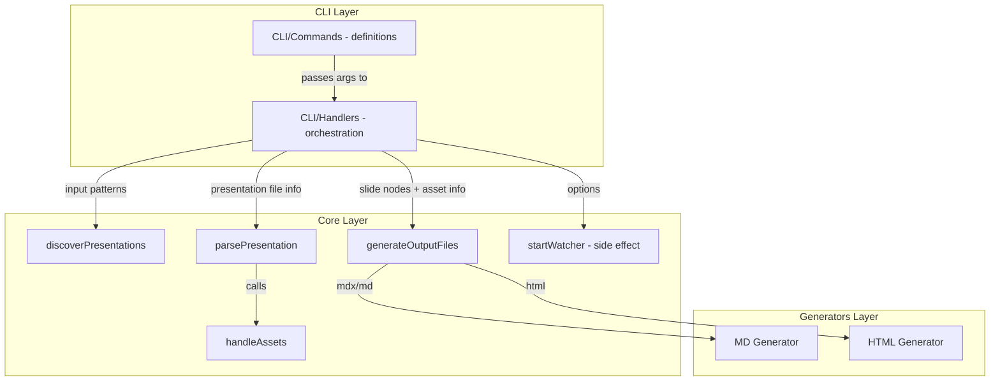

# Implementation Structure Diagram (Main System, No Test Code)

This diagram shows the code structure and functional interactions for the CLI Application Core and all main runtime modules, including generators. Test code is excluded. Each module/folder is a node, with key files as sub-nodes. Arrows represent function calls or data flow. The design emphasizes functional programming and clear module boundaries.

- **CLI Layer**: Split into commands (argument parsing, option definitions) and handlers (orchestration logic).
- **Core Layer**: Pure functions for discovery, parsing, asset handling, generation, and file watching.
- **Generators Layer**: Specialized output generators for MD/MDX and HTML.
