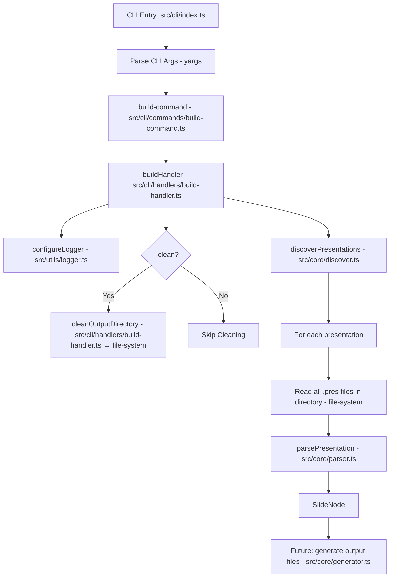

# F1: CLI Application Core - Implementation Details

This document outlines the implementation plan for Feature F1: CLI Application Core, updated to match the technical_implementation.md folder structure and requirements.

## Architectural Principle

All core modules (discovery, parsing, generation, etc.) are pure functions: they take input, return output, and do not know about or call other modules. The CLI/build command is the sole orchestrator, sequencing the calls, passing outputs as inputs, and managing all side effects (watching, logging, etc.).

## Folder Structure (per technical_implementation.md)

- `src/cli/`
  - `index.ts`: Main CLI entry point using yargs.
  - `index.test.ts`: Tests for CLI entry point.
  - `commands/`
    - `build-command.ts`: Defines the build command and its options. **Users must always pass the `build` command explicitly; there is no default command.**
    - `build-command.test.ts`: Tests for build command.
    - `index.ts`: Exports all command modules.
  - `handlers/`
    - `build-handler.ts`: Implements the handler function for the build command.
    - `build-handler.test.ts`: Tests for build handler function.
    - `index.ts`: Exports all handlers.
- `src/core/`
  - `index.ts`: export of core functions in other libs
  - `discover.ts` # Pure function: discovers presentation files
  - `parser.ts` # Pure function: parses presentation source into metadata and slides
  - `generator.ts` # Pure function: generates output files (MD/MDX)
  - `processor.ts` # (Optional: pure helpers for processing)
  - `watcher.ts` # Handles file watching and triggers reprocessing (side effect)
  <!-- - `asset-handler.ts` # Pure function: manages image copying and Mermaid rendering -->
- `src/generators/`
  - `index.ts`: export of core functions from modules
  - `md-generator`: process the slideNodes and creates md files
  - `html-generator`: process the slideNodes and created output html
- `src/utils/`
  - `logger.ts`: Logger utility (singleton pattern, uses console methods)
  - `file-system.ts`: FS utilities (read, write, mkdirp, copy, glob)
  - `index.ts`: Exports all utils.
- `src/types/`
  - `cli.ts`: TypeScript type definitions related to the CLI (e.g., ParsedBuildArgs).
  - `index.ts`: Exports all types.
- `test/unit/cli/`
  - `index.test.ts`: Tests for basic CLI functionality (help, version, command behavior).
  - `build.test.ts`: Tests for the build command, its options, and interaction with handlers.
- `package.json`: Add bin entry to make the CLI executable (e.g., parse-a-slide).

## Orchestration Flow

- The CLI/build command is the only orchestrator. It:
  - Parses and validates options (including `--watch`).
  - Calls `discoverPresentations()` (pure) to get presentation file info.
  - Passes results to `parsePresentation()` (pure) to get slide nodes.
  - Passes slide nodes to `generateOutputFiles()` (pure)
  - If `--watch` is enabled, starts the watcher (side effect).
- **No core function triggers or depends on another core function internally.**

## Phase 1: Project Setup & Basic CLI Structure

1. **File & Directory Creation:**

   - As above, matching the technical_implementation.md structure.
   - Each folder (`commands`, `core`, `generators`, `utils`, `types`) has an `index.ts` exporting its main functions.

2. **Initial yargs Setup (`src/cli/index.ts`):**
   - Initialize yargs.
   - Set scriptName("parse-a-slide").
   - Configure global options like --help and --version (using package.json).
   - Import and register the build command from `src/cli/commands/build-command.ts`.
   - **Require users to always pass the `build` command explicitly.** There is no default command.
   - Use .strict() to enforce known options and .parseAsync() for execution.

## Phase 2: Implement build Command, Options, and Handler

1. **Define build Command (`src/cli/commands/build-command.ts`):**

   - Command: build <input...>
   - Description: "Process presentation source files and generate specified output format."
   - **Options:**
     - input (Positional argument, string[], required): Input source file(s) or glob patterns.
     - output-dir (Alias: -o, Type: string, Default: ./dist_slides): Specifies the directory for output files.
     - format (Alias: -f, Type: string, Choices: ['md', 'mdx', 'html'], Default: mdx): Defines the output format.
     - watch (Alias: -w, Type: boolean, Default: false): Enables watch mode for automatic rebuilding on file changes.
     - clean (Type: boolean, Default: false): Cleans the output directory before building.
     - verbose (Alias: -v, Type: boolean, Default: false): Enables verbose logging. This will control the logger's output level.
   - Handler: Points to buildHandler from `src/cli/handlers/build-handler.ts` (which manages orchestration).

2. **Implement build Handler (`src/cli/handlers/build-handler.ts`):**
   - Define async function buildHandler(args: ParsedBuildArgs). ParsedBuildArgs will be an interface in `src/types/cli.ts`.
   - **Logger:**
     - Use a singleton logger pattern, but keep the implementation simple: use `console.log`, `console.error`, etc.
     - In tests, use a default mock logger so logs do not show in the console. The logger can be swapped for a mock in test setup.
   - **Dummy/Mockable Functions**
     - Create the dummy functions needed for the orchestration of the command based on the folder structure. All core function stubs will be created in their respective directories with correct signatures and no implementation, to be mocked in tests.
   - **Types:**
     - Use type inference as much as possible. Minimize explicit return types and interface types for functions; let function definitions manage types unless a type is needed for cross-module usage or clarity.

## Phase 3: Logger Utility (`src/utils/logger.ts`)

1. **Core Functionality:**
   - Provide logging functions (e.g., info, error, debug, warn) using console methods.
   - Implement a singleton logger instance with `configureLogger(level)` and `getLogger()`.
   - In tests, use a mock logger to suppress or capture output.
2. **Decorator Support (Conceptual):**
   - Design and implement TypeScript decorators (e.g., @LogActivity(), @LogTiming()) that can be applied to methods.
   - Decorators should use the logger instance to output relevant information (e.g., method entry/exit, execution time).
   - The logger instance needs to be accessible to these decorators, via the singleton pattern.

## Phase 4: Testing (\*.test.ts)

- All tests should treat core modules as pure functions, and only the CLI/build command as the orchestrator.
- Tests for the build handler should verify correct sequencing and data passing between pure functions, not internal calls between core modules.
- All test files should be placed next to the files they are testing with a `.test.ts` extension.

### 1. Basic CLI Tests (`src/cli/index.test.ts`)

- [x] **Test: CLI shows help text with --help**

  - Setup:
    - Invoke CLI with `--help` argument.
  - Assertions:
    - Output contains usage/help text.
    - No errors are thrown.

- [x] **Test: CLI shows version with --version**

  - Setup:
    - Invoke CLI with `--version` argument.
  - Assertions:
    - Output matches version from `package.json`.
    - No errors are thrown.

- [x] **Test: CLI requires explicit build command**

  - Setup:
    - Invoke CLI with no command.
  - Assertions:
    - Output indicates that a command is required.
    - Error is thrown or process exits with error code.

- [x] **Test: CLI rejects unknown commands**

  - Setup:
    - Invoke CLI with an unknown command (e.g., `foo`).
  - Assertions:
    - Output contains error about unknown command.
    - Process exits with error code.

- [x] **Test: CLI rejects unknown options**

  - Setup:
    - Invoke CLI with an unknown option (e.g., `--unknown`).
  - Assertions:
    - Output contains error about unknown option.
    - Process exits with error code.

- [ ] **Test: CLI build command triggers handler with correct args**
  - Setup:
    - Mock `buildHandler`.
    - Invoke CLI with `build` and various options (e.g., `--input foo.md -o custom_out --format html --watch --clean --verbose`).
  - Assertions:
    - `buildHandler` is called once with expected parsed arguments.

### 2. Build Command & Handler Tests (`src/cli/commands/build-command.test.ts`)

- [ ] **Test: Parses required input argument**

  - Setup:
    - Mock dependencies.
    - Call build command with one or more input files.
  - Assertions:
    - Handler receives correct input array.
    - Error if input is missing.

- [ ] **Test: Applies default values for options**

  - Setup:
    - Call build command with only required input.
  - Assertions:
    - Handler receives default values for outputDir, format, watch, clean, and verbose.

- [ ] **Test: Applies option aliases**

  - Setup:
    - Call build command using aliases (e.g., `-o`, `-f`, `-w`, `-v`).
  - Assertions:
    - Handler receives correct values for each option.

- [ ] **Test: Validates format choices**

  - Setup:
    - Call build command with valid and invalid `--format` values.
  - Assertions:
    - Handler receives correct format for valid values.
    - CLI errors for invalid values.

- [ ] **Test: Calls cleanOutputDirectory when --clean is set**

  - Setup:
    - Mock `cleanOutputDirectory`.
    - Call build command with `--clean`.
  - Assertions:
    - `cleanOutputDirectory` is called before processing presentations.

- [ ] **Test: Does not call cleanOutputDirectory when --clean is not set**

  - Setup:
    - Mock `cleanOutputDirectory`.
    - Call build command without `--clean`.
  - Assertions:
    - `cleanOutputDirectory` is not called.

- [ ] **Test: Orchestrates parsePresentation for each presentation**

  - Setup:
    - Mock all core functions as pure.
    - Call build command with multiple input files representing different presentations.
  - Assertions:
    - Each pure function is called with the correct data, in the correct order, and receives only the data it needs.
    - No core function is called by another core function.

- [ ] **Test: Logger is initialized with correct verbosity**

  - Setup:
    - Mock logger.
    - Call build command with and without `--verbose`.
  - Assertions:
    - Logger is configured with correct log level.

- [ ] **Test: Handles errors from handler gracefully**
  - Setup:
    - Mock handler to throw error.
    - Call build command.
  - Assertions:
    - Error is logged.
    - Process exits with error code.

### 3. Logger Tests (`src/utils/logger.test.ts`)

- [ ] **Test: Logger outputs messages at each log level**

  - Setup:
    - Configure logger at each level (info, warn, error, debug).
    - Call logger methods.
  - Assertions:
    - Only messages at or above the configured level are output.

- [ ] **Test: Logger suppresses output below current level**

  - Setup:
    - Configure logger at higher level (e.g., error).
    - Call info, warn, debug methods.
  - Assertions:
    - Only error messages are output.

- [ ] **Test: Logger can be swapped for a mock in tests**

  - Setup:
    - Replace logger with mock implementation.
    - Call logger methods.
  - Assertions:
    - No output to console.
    - Mock methods are called as expected.

- [ ] **Test: @LogActivity decorator logs method entry/exit**

  - Setup:
    - Apply @LogActivity to a test method.
    - Call method.
  - Assertions:
    - Logger logs method entry and exit.
    - Log messages include method name.

- [ ] **Test: @LogTiming decorator logs execution time**

  - Setup:
    - Apply @LogTiming to a test method.
    - Call method.
  - Assertions:
    - Logger logs execution time for method.
    - Log message includes method name and duration.

- [ ] **Test: Decorators use singleton logger instance**
  - Setup:
    - Apply decorators to methods.
    - Replace logger singleton with mock.
    - Call methods.
  - Assertions:
    - Decorators use the current logger instance for output.

## Files, Methods, and Status

- **src/cli/index.ts** (New)
  - Main entry, yargs setup
- **src/cli/index.test.ts** (New)
  - Test cases for CLI entry and command parsing
- **src/cli/commands/build-command.ts** (New)
  - Defines the build command with its options and points to its handler
- **src/cli/commands/build-command.test.ts** (New)
  - Test cases for command definition and option parsing
- **src/cli/commands/index.ts** (New)
  - Exports all CLI commands
- **src/cli/handlers/build-handler.ts** (New)
  - `buildHandler` — Orchestrates the build process, calls discovery, cleaning, parsing, and logging
  - `cleanOutputDirectory` — Uses file-utils to delete everything in a given path
- **src/cli/handlers/build-handler.test.ts** (New)
  - Test cases, mocks for handler and core functions
- **src/cli/handlers/index.ts** (New)
  - Exports all handler functions
- **src/core/index.ts** (New)
  - Exports all core functions
- **src/core/discover.ts** (New)
  - `discoverPresentations` — Discovers presentation files from input patterns
- **src/core/parser.ts** (New)
  - `parsePresentation` — Pure function; parses a presentation and its fragments
- **src/core/generator.ts** (New, stub)
  - For future output file generation
- **src/core/processor.ts** (New, stub)
  - For future orchestration of a single presentation
- **src/core/watcher.ts** (New, stub)
  - For future file watching
- **src/utils/logger.ts** (New)
  - `configureLogger` — Configures the logger singleton
  - `getLogger` — Returns the logger instance
- **src/utils/logger.test.ts** (New)
  - Test cases, mock logger
- **src/utils/file-system.ts** (New)
  - File system utilities (used by cleanOutputDirectory)
- **src/utils/file-system.test.ts** (New)
  - Test cases for file system utilities
- **src/types/cli.ts** (New)
  - `ParsedBuildArgs` — Types for CLI arguments and handler input
- **src/types/index.ts** (New)
  - Exports all types

**Legend:**

- **New**: File/method is being created for F1.
- **Mocked**: File/method is currently mocked in tests for F1.

---

## Orchestration Flow (Mermaid Diagram)

---

## Relevant Rules

- **general**: Applies to all feature implementations. Ensures alignment with project architecture, minimal code, and adherence to coding standards.
- **testing**: Guides test structure, use of Vitest, mocking, and test data practices.
- **typescript-guidelines**: For type safety, naming, and organization. Use types over interfaces, clear naming, and export shared types.
- **typescript-types**: Reinforces type usage, union types, type composition, and avoidance of `any` or implicit types.
