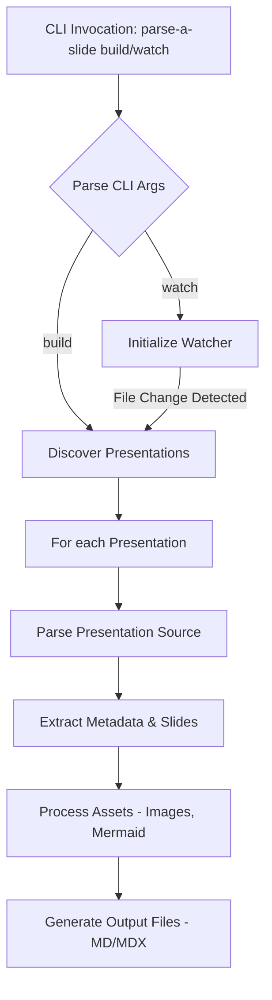

# Technical Implementation: parse-a-slide

This document outlines the technical implementation details for the `parse-a-slide` CLI tool, a framework for processing Markdown-based presentations.

## 1. High-Level Architecture

The system is designed as a CLI application that processes source presentation files (Markdown/MDX) and outputs them into desired formats. It involves discovery, parsing, asset handling, and generation steps. A watch mode will provide real-time reprocessing during development.



## 2. Proposed Folder Structure

```
parse-a-slide/
├── _doc/
│ ├── overview.md
│ └── technical_implementation.md
├── src/
│ ├── cli/
│ │ ├── index.ts # Main CLI entry point, command parsing (e.g., using yargs)
│ │ └── commands/
│ │ └── run.ts # Logic for the main command (handling build and conditional watch)
│ ├── core/
│ │ ├── discover.ts # Discovers presentation files
│ │ ├── parser.ts # Parses presentation source into metadata and slides
│ │ ├── generator.ts # Generates output files (MD/MDX)
│ │ ├── processor.ts # Orchestrates processing of a single presentation
│ │ ├── watcher.ts # Handles file watching and triggers reprocessing
│ │ └── asset-handler.ts # Manages image copying and Mermaid rendering
│ ├── types/
│ │ ├── index.ts # Exports all type definitions
│ │ └── presentation.ts # Defines SlideNode, PresentationMetadata etc.
│ └── utils/
│ ├── file-system.ts # FS utilities (read, write, mkdirp, copy, glob)
│ └── logger.ts # Logging utility
├── templates/ # Optional: For future HTML output or other templates
│ └── rules/
│ └── llm-authoring-rules.md # Rules for LLMs to generate presentation markdown
├── test/
│ ├── unit/
│ │ └── parser.spec.ts # Example unit test for parser
│ └── fixtures/
│ └── sample-presentation.md # Sample input for tests
├── package.json
├── tsconfig.json
├── README.md
└── LICENSE

```

## 3. CLI Design

The CLI will be the primary interface for users. We'll use a library like `yargs` for command and option parsing.

### Main Command: `parse-a-slide`

- **Description**: Discovers, processes, and generates output for presentation source files. Can optionally watch for changes.
- **Options**:
  - `--input <pattern>` / `-i <pattern>`: Glob pattern for input files/directories (e.g., `"presentations/**/*.md"`). Can be specified multiple times. Defaults to a sensible pattern like `./**/*.pres.md`.
  - `--output-dir <path>` / `-o <path>`: Directory where processed presentations will be saved. Defaults to `./dist_presentations`.
  - `--format <format>` / `-f <format>`: Output format. Supported: `mdx` (default), `md`. Future: `html`. When `html` is selected, Mermaid diagrams will be rendered to SVG images; otherwise, raw Mermaid syntax is preserved.
  - `--watch` / `-w`: Enable watch mode. When enabled, the tool will perform an initial build and then watch input files/directories for changes, rebuilding automatically.
  - `--clean`: Clean the output directory before building.
  - `--verbose` / `-v`: Enable verbose logging.

### Entry Point (`src/cli/index.ts`)

This file will configure `yargs` (or a similar library) to define the main command, its options, and route execution to the appropriate command handler logic (which might reside in `src/cli/commands/` or be consolidated).

## 4. Core Modules and Responsibilities

### a. `src/cli/commands/run.ts` (or consolidated logic)

- **`run(options)`**:
  - Parses and validates options (including `--watch`).
  - Calls `discoverPresentations()` from `discover.ts`.
  - For each discovered presentation, calls `processPresentation()` from `processor.ts`.
  - Handles overall logging and error reporting for the initial build process.
  - If `options.watch` is true:
    - Initializes and runs the watcher by calling `startWatcher()` from `watcher.ts`.
    - The `startWatcher` will be provided with callbacks to re-process individual files or presentations based on changes.

### b. `src/core/discover.ts`

- **`discoverPresentations(inputPatterns: string[]): Promise<string[]>`**:
  - Takes an array of glob patterns.
  - Uses a globbing library (e.g., `glob` or `fast-glob`) to find all matching presentation source files.
  - Returns a list of absolute file paths to these main presentation files.
  - Identifies main presentation entry point files, which must be named `index.pres.md` or `index.pres.mdx` within their respective presentation folders.
  - Each presentation folder is expected to contain its `index.pres.md(x)` file and an `assets/` subfolder for all images and static content.
  - Other `.pres.md` or `.pres.mdx` files within the same presentation folder are considered fragments and will be processed as part of the presentation defined by `index.pres.md(x)`.

### c. `src/core/parser.ts`

This module is central to understanding the presentation structure.

- **`parsePresentationSource(filePath: string): Promise<{ presentationMetadata: PresentationMetadata, slides: Map<string, SlideNode>, rawContent: string }>`**:
  - Reads the content of the given presentation file.
  - Uses `gray-matter` to extract the main frontmatter (`presentationMetadata`) and the Markdown/MDX body.
  - Invokes `parseSlides(mdxBody: string, presentationSlug: string)` to get `slides: Map<string, SlideNode>`.
  - Returns an object containing `presentationMetadata`, the `slides` map, and the `rawContent` (body).
- **`parseSlides(mdxBody: string, presentationSlug: string): Map<string, SlideNode>`**:
  - Scans the MDX body for `<!-- slide-start [metadata] -->` and `<!-- slide-end -->` comments.
  - Handles nested slide structures.
  - Extracts metadata from slide-start comments (e.g., `title`, `transition`, `hidden`, `id`).
  - Generates unique slide IDs if not provided, ensuring hierarchical structure (e.g., `S1`, `S1.1`, `S2`).
  - Manages parent/child/next/prev relationships between slides.
  - Detects reusable slide patterns (e.g., `[](./reusable.pres.md | /reusable.pres.mdx)`). If found:
    - Recursively calls `parsePresentationSource` (or a similar targeted function) for the linked file.
    - Inlines the slides from the reusable file into the current slide tree, adjusting IDs and navigation links appropriately.
  - Returns a `Map<string, SlideNode>` where the key is the slide ID.

### d. `src/core/generator.ts`

- **`generateOutputFiles(presentationSlug: string, presentationMetadata: PresentationMetadata, slides: Map<string, SlideNode>, outputDir: string, format: 'mdx' | 'html', assets: ProcessedAssets)`**:
  - Defines output paths based on `outputDir` and `presentationSlug` for each slide.
  - Creates necessary directories (e.g., `outputDir/presentationSlug/`, and `outputDir/presentationSlug/mermaid_images/` if `format` is `html`).
  - Iterates through each `slideNode` in the `slides` map.
  - Constructs the frontmatter for each individual output slide file.
  - For slide content:
    - If `format` is `'html'`:
      - Iterates through the `slideNode.rawContent` and replaces ` ```mermaid ... ``` ` blocks with `` tags. The `src` for the `` tag will be the path to the corresponding SVG file from `assets.mermaid` (e.g., `../mermaid_images/diagram-<hash_or_id>.svg`).
    - If `format` is `'original'`, which is the default:
      - The `slideNode.rawContent` (including raw Mermaid syntax) is used directly.
  - Image paths (non-Mermaid) are assumed to be correctly authored with relative paths to the `assets/` directory in the source and will remain valid as the entire `assets/` directory is copied.
  - Writes each individual slide file (e.g., `outputDir/presentationSlug/S1.mdx` or `outputDir/presentationSlug/S1.html`) to the specified location.

### e. `src/core/processor.ts`

- **`processPresentation(sourceFilePath: string, outputDir: string, format: 'md' | 'mdx', clean: boolean)`**:
  - Derives a `presentationSlug` from `sourceFilePath` (e.g., filename or parent directory name).
  - Calls `parsePresentationSource(sourceFilePath)` from `parser.ts`.
  - Calls `handleAssets()` from `asset-handler.ts` to process images and Mermaid diagrams found during parsing.
  - Calls `generateOutputFiles()` from `generator.ts` with the parsed data and processed asset information.
- **`deleteGeneratedPresentation(presentationSlug: string, outputDir: string)`**:
  - Removes the output directory for a given presentation (used by watch mode on source deletion).

### f. `src/core/watcher.ts`

- **`startWatcher(inputPatterns: string[], processCallback: (filePath: string) => Promise<void>, deleteCallback: (filePath: string) => Promise<void>)`**:
  - Uses a library like `chokidar`.
  - Monitors specified `inputPatterns` for add, change, and delete events.
  - On file add/change: Triggers `processCallback` (which would typically invoke `processPresentation` for the affected file/presentation).
  - On file/directory delete: Triggers `deleteCallback` (which would typically invoke `deleteGeneratedPresentation`).
  - Handles watching for presentation source files and associated asset directories (e.g., `images/`).

### g. `src/core/asset-handler.ts`

- **`handleAssets(slides: Map<string, SlideNode>, sourcePresentationDir: string, outputPresentationDir: string, presentationSlug: string, outputFormat: 'md' | 'mdx' | 'html'): Promise<ProcessedAssets>`**:
  - Locates the `assets/` directory within the `sourcePresentationDir`.
  - Copies the entire `assets/` directory from `sourcePresentationDir` to `outputPresentationDir` (e.g., `outputPresentationDir/presentationSlug/assets/`). This ensures all relative links from presentation content to assets (like images) remain valid.
  - Initializes `processedMermaidAssets = new Map<string, string>()`.
  - **If `outputFormat` is `'html'`**:
    - Iterates through `slides` to find Mermaid code blocks.
    - For each ` ```mermaid ... ``` ` block:
      - Uses a Mermaid CLI or library (e.g., `mermaid.cli` or a puppeteer-based solution) to render the diagram to an SVG image.
      - Saves the generated SVG to a dedicated directory, e.g., `outputPresentationDir/presentationSlug/mermaid_images/diagram-<hash_or_id>.svg`.
      - Stores a mapping from a unique identifier for the Mermaid block (e.g., its content hash) to the new relative path of the SVG in `processedMermaidAssets`.
  - Returns `ProcessedAssets` which would be an object like `{ mermaid: processedMermaidAssets }`. For MD/MDX formats, the `mermaid` map will be empty. Image paths are implicitly handled by the `assets/` folder copy and correct relative linking in the source markdown.

## 5. Key Data Models/Types (`src/types/presentation.ts`)

```typescript
export interface PresentationMetadata {
  title: string
  slideCount: number
  description?: string
  author?: string
  date?: string //ISO Data String
  // Any other user-defined frontmatter
  [key: string]: any
}

export interface SlideMetadata extends PresentationMetadata {
  title?: string
  transition?: string
  backgroundImage?: string
  hidden?: boolean
  // Any other slide-specific metadata from <!-- slide-start [metadata] -->
  [key: string]: any
}

export interface SlideNode {
  id: string // Generated, unique, hierarchical ID (e.g., "S1", "S1.1")
  rawContent: string // The Markdown/MDX content of the slide
  metadata: SlideMetadata // Metadata extracted from slide-start comment
  presentationSlug: string // Slug of the parent presentation
  sourceFilePath: string // Path to the original source file for this slide's content

  // Navigation properties
  parentId?: string | null
  childrenIds: string | null // Next child id
  nextSlideId?: string | null // Next sibling
  prevSlideId?: string | null // Previous sibling
}

export interface ProcessedAssets {
  mermaid: Map<string, string> // Map<mermaidBlockHashOrId, newImagePathForHTMLOutput>
}
```

## 6. Conceptual Processing Pipeline (Main Command)

1.  **CLI Invocation**: `parse-a-slide -i "presentations/**/*.md" -o "output"` (or `parse-a-slide -i "presentations/**/*.md" -o "output" --watch`)
2.  **Argument Parsing** (`src/cli/index.ts` & `src/cli/commands/run.ts` (or consolidated logic)):
    - Input patterns: `["presentations/**/*.md"]`
    - Output directory: `"output"`
3.  **Discovery** (`src/core/discover.ts` -> `discoverPresentations`):
    - Glob matches `presentations/deck1/index.md`, `presentations/deck2/slides.md`.
    - Returns `["/abs/path/to/presentations/deck1/index.md", "/abs/path/to/presentations/deck2/slides.md"]`.
4.  **Iteration** (`src/cli/commands/run.ts`): Loop through discovered files.
    - **Current file**: `/abs/path/to/presentations/deck1/index.md`
5.  **Processing** (`src/core/processor.ts` -> `processPresentation`):
    - `presentationSlug` = `"deck1"` (derived from path).
    - **Parsing** (`src/core/parser.ts` -> `parsePresentationSource`):
      - Reads `index.md`.
      - Extracts frontmatter (e.g., `{ title: "Deck 1" }`) -> `PresentationMetadata`.
      - Calls `parseSlides` on the body:
        - Finds `<!-- slide-start -->...<!-- slide-end -->` blocks.
        - Identifies reusable slides `[](./common-intro.md)`:
          - Recursively calls a parsing function for `common-intro.md`.
          - Merges slides from `common-intro.md` into the current slide tree.
        - Generates `SlideNode` objects with IDs, content, metadata, and navigation links.
        - Returns `Map<string, SlideNode>`.
      - Result: `{ presentationMetadata, slides, rawContent }`.
    - **Asset Handling** (`src/core/asset-handler.ts` -> `handleAssets(..., format)`):
      - Copies `presentations/deck1/assets/` to `output/deck1/assets/`.
      - If `format` is `html`:
        - Scans `slides` for ` ```mermaid ... ``` `.
        - Renders Mermaid diagram to `output/deck1/mermaid_images/diagram1.svg`.
        - `ProcessedAssets` will map the Mermaid block to `../mermaid_images/diagram1.svg`.
      - If `format` is `mdx` or `md`:
        - Mermaid diagrams are not processed at this stage. `ProcessedAssets.mermaid` will be empty.
    - **Generation** (`src/core/generator.ts` -> `generateOutputFiles(..., format, assets)`):
      - Creates `output/deck1/`.
      - For each `SlideNode`:
        - Constructs new frontmatter.
        - If `format` is `html`:
          - Slide content is updated: ` ```mermaid ... ``` ` is replaced with ``.
          - Writes `output/deck1/S1.html`, etc.
        - If `format` is `mdx` or `md`:
          - Slide content (with raw Mermaid syntax) is used directly.
          - Writes `output/deck1/S1.mdx` (or `.md`), etc.
        - Image links `` remain relative and valid due to the `assets/` folder copy.
6.  **Repeat** for `presentations/deck2/slides.md`.
