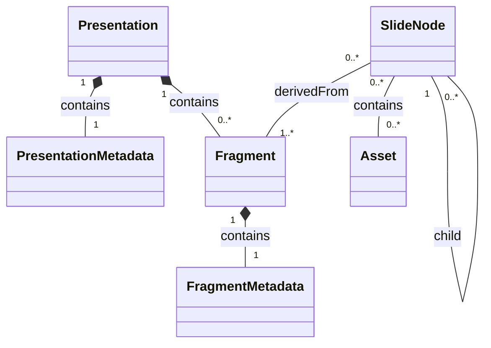

# Data Model

This document outlines the internal data model used for processing presentations. This model is not persisted but represents the in-memory structure during parsing and transformation.

## Core Entities

The data model consists of the following core entities:

1.  **PresentationMetadata**
2.  **FragmentMetadata**
3.  **Fragment**
4.  **Presentation**
5.  **SlideNode**

---

### 1. PresentationMetadata

`PresentationMetadata` stores information programmatically gathered about the main presentation file or entry point.

**Attributes:**

- `id`: (String) A unique identifier generated for the presentation.
- `url`: (String) A URL representing the presentation.
- `fullPath`: (String) The absolute file system path to the presentation's entry point.
- `name`: (String) The name of the presentation (e.g., directory name for `index.pres` or the filename itself).
- `extension`: (String) The file extension of the presentation's entry point.

---

### 2. FragmentMetadata

`FragmentMetadata` stores information about individual files that constitute parts of the overall presentation.

**Attributes:**

- `id`: (String) A unique identifier generated for the fragment.
- `name`: (String) The name of the fragment file.
- `fullPath`: (String) The absolute file system path to the fragment file.
- `isEntry`: (Boolean) Indicates if this fragment is the main entry point of the presentation (e.g., `index.pres`).
- `absolutePosition`: (Object, Optional) Information about the fragment's absolute position if applicable (e.g., coordinates or sequence in a larger document).
- `relativePosition`: (Object, Optional) Information about the fragment's position relative to other elements if applicable.

---

### 3. Fragment

A `Fragment` represents an individual component or file of the presentation, combining its metadata with its actual content.

**Attributes:**

- `metadata`: (`FragmentMetadata`) The metadata object associated with this fragment.
- `content`: (String) The raw content of the fragment file.

---

### 4. Presentation

The `Presentation` object is the top-level container representing the entire presentation structure as understood by the system.

**Attributes:**

- `metadata`: (`PresentationMetadata`) The metadata for the main presentation.
- `fragments`: (Array of `Fragment`) A list of all fragments that make up the presentation.

---

### 5. SlideNode

A `SlideNode` represents a conceptual slide within the presentation. It aggregates content and metadata, potentially from multiple fragments, and includes navigation information. It forms the basis for the final, navigable slide structure.

**Attributes:**

- `id`: (String) A unique identifier for the slide.
- `url`: (String) A URL to directly access this slide.
- `title`: (String, Optional) The title of the slide.
- `description`: (String, Optional) A description for the slide.
- `date`: (String, Optional) The date associated with the slide's content.
- `author`: (Object | String, Optional) The author associated with the slide's content.
  - `name`: (String) The name of the author.
  - `email`: (String, Optional) The email address of the author.
  - `website`: (String, Optional) The website of the author.
- `navigation`: (Object) Contains identifiers to link related slides:
  - `previousSlideId`: (String, Nullable) ID of the previous slide in sequence.
  - `nextSlideId`: (String, Nullable) ID of the next slide in sequence.
  - `childSlideIds`: (Array of String) IDs of child slides, for hierarchical structures.
  - _(Note: Navigational URLs can be constructed using these IDs and a base path or lookup mechanism during rendering or API exposure)._
- `userDefinedFrontMatter`: (Object) A key-value store for any additional front matter defined by the user in the source file(s) that contribute to this slide.
- `appearance`: (Object, Optional) Configuration for the slide's visual styling and interactive elements:
  - `theme`: (String, Optional) Specifies a theme for the slide or overrides the presentation theme.
  - `transition`: (String, Optional) Specifies the transition effect for this slide (e.g., "fade", "slideLeft").
  - `backgroundImage`: (String, Optional) URL or path to a background image for the slide.
  - `layout`: (String, Optional) Specifies a layout template for the slide (e.g., "title-only", "two-column").
  - `timing`: (Object, Optional) Configuration for timed transitions or animations (e.g., `{ duration: 5000, autoAdvance: true }`).
  - Other rendering-specific attributes.
- `content`: (String) The processed and aggregated content that constitutes this slide, ready for display.
- `assets`: (Array of `Asset`) A list of assets associated with this slide, including images, videos, or other media. It will have the asset relative paths and the actual asset in memory.

We will also create a SlideNodes type which is a list of `SlideNode` objects.

**Relationships:**

- A `SlideNode` can be derived from one or more `Fragment`s. It represents the logical structure of slides, which might not map one-to-one with physical files (fragments), allowing for complex compositions and hierarchies.

### 6. Asset

An `Asset` represents a file or resource (e.g., an image, video, or other media) that is associated with a `SlideNode`.

**Attributes:**

- `id`: (String) A unique identifier for the asset.
- `relativePath`: (String) The relative path to the asset from the presentation's root directory.
- `content`: (String) The content of the asset (e.g., base64 encoded image data).

### Data Model UML Diagram

