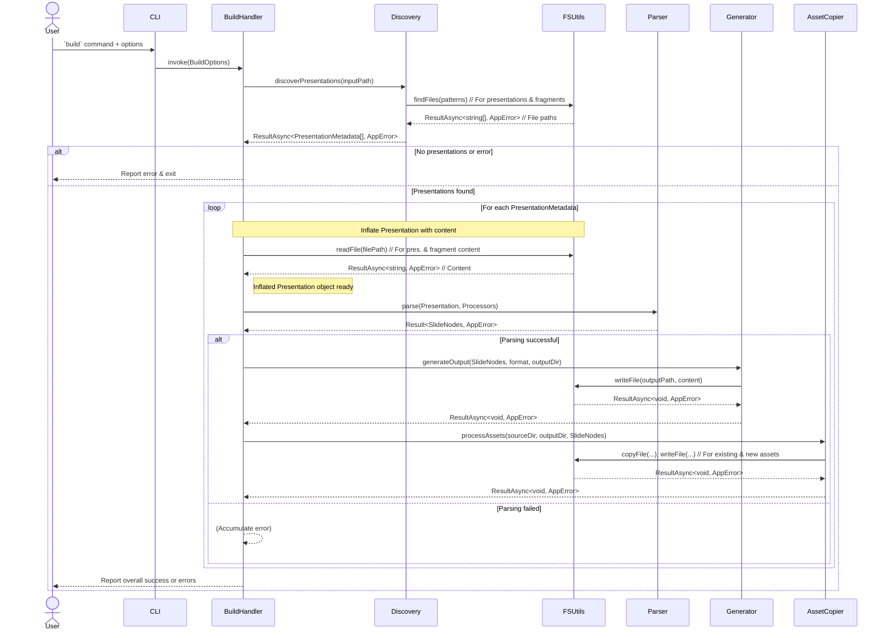

# System Design: CLI Slide Parser

## 1. Introduction

This document outlines the high-level design for a command-line interface (CLI) application responsible for parsing presentation slides from source files (MD/MDX) and generating output in various formats (HTML, MDX).

## 2. Overall Architecture

- **Type**: Command-Line Interface (CLI) application.
- **Framework**: `yargs` for parsing command-line arguments and managing commands.
- **Language**: TypeScript.
- **Core Principle**: Modular design with clear separation of concerns. Each module will have a specific responsibility.
- **Export Strategy**: Each module (typically a folder) will have an `index.ts` file that exports only the public-facing functions and types. Internal components will not be exported to maintain encapsulation.
- **Error Handling**: The `neverthrow` library will be used for robust error handling, avoiding traditional `try/catch` blocks and `throw` statements for expected errors. Functions will return `Result` or `ResultAsync` objects.

## 3. Folder Structure

```
parse-a-slide/
├── _docs/
│   └── 20-System-Design.md  // This document
├── src/
│   ├── cli/
│   │   ├── commands/
│   │   │   ├── build.ts       // Logic for the 'build' command
│   │   │   └── index.ts       // Exports command modules
│   │   ├── handlers/
│   │   │   ├── buildHandler.ts// Orchestrates the build process
│   │   │   └── index.ts       // Exports handler modules
│   │   ├── index.ts           // Exports CLI setup
│   │   └── cli.ts             // Main CLI entry point, yargs setup
│   ├── core/
│   │   ├── discovery.ts       // Discovers presentation and fragment files
│   │   ├── parser.ts          // Parses presentation content into slide nodes
│   │   ├── generator.ts       // Generates output files (HTML/MDX)
│   │   ├── processors/        // Directory for slide node processors
│   │   │   └── index.ts       // Exports processors
│   │   ├── types/             // Shared TypeScript types and interfaces
│   │   │   ├── index.d.ts
│   │   │   └── presentation.ts  // Definition for SlideNode, PresentationMetadata, etc.
│   │   └── index.ts           // Exports core modules
│   ├── utils/
│   │   ├── fsUtils.ts         // File system utilities (wrapping Node.js fs and glob)
│   │   ├── assetCopier.ts     // Utility for copying assets
│   │   └── index.ts           // Exports utility modules
│   └── index.ts               // Main application entry point (if needed, or re-exports cli.ts)
├── package.json
├── tsconfig.json
└── README.md
```

## 4. Core Components & Descriptions

### 4.1. CLI (`src/cli/`)

- **Responsibility**: Handles command-line argument parsing, command registration, and invoking the appropriate handlers.
- **Key Files**:
  - `cli.ts`: Main entry point for the CLI. Initializes `yargs`, defines commands, and maps them to handlers.
  - `commands/build.ts`: Defines the `build` command, its options (`input`, `output`, `format`), and calls the `buildHandler`.
  - `handlers/buildHandler.ts`: Orchestrates the entire build process. It receives parsed CLI arguments and coordinates the actions of `Discovery`, `Parser`, `Generator`, and `AssetCopier`.

### 4.2. Discovery (`src/core/discovery.ts`)

- **Responsibility**:
  - Takes an input directory path.
  - Uses `FSUtils` to find presentation files (e.g., `*.pres.md`, `*.pres.mdx`).
- **Dependencies**: `FSUtils`.
- **Output**: `ResultAsync<PresentationMetadata[], AppError>`

### 4.3. FSUtils (`src/utils/fsUtils.ts`)

- **Responsibility**:
  - Provides an abstraction layer over Node.js file system operations (`fs` module) and glob pattern matching (e.g., `glob` library).
  - All functions wrap their operations with `neverthrow` to return `Result` or `ResultAsync` objects, ensuring consistent error handling.
  - Functions include: reading files, writing files, checking file/directory existence, listing directory contents based on glob patterns.
- **Key Functions**:
  - `readFile(path: string): ResultAsync<string, AppError>`
  - `writeFile(path: string, content: string): ResultAsync<void, AppError>`
  - `findFiles(globPattern: string, cwd: string): ResultAsync<string[], AppError>`
- **Dependencies**: Node.js `fs`, `path`, `glob` library, `neverthrow`.

### 4.4. Parser (`src/core/parser.ts`)

- **Responsibility**:
  - Takes inflated `PresentationMetadata` (with content) and its associated `FragmentMetadata` (with content).
  - Parses the content according to defined rules to construct a structured representation of the presentation, typically a tree of `SlideNode` objects.
  - Applies an array of `Processor` functions to each `SlideNode` to extend or modify its data.
  - Does **not** perform any file I/O operations. All necessary content is provided as input.
- **Input**:
  - `presentation: Presentation`
  - `processors: Processor[]`
- **Output**: `Result<SlideNodes, AppError>` (an array of root slide nodes for the presentation)

### 4.5. Processors (`src/core/processors/`)

- **Responsibility**:
  - Functions that take a `SlideNode` as input and return an updated `SlideNode`.
  - Used to extend the parsing logic and add or transform data within slide nodes.
  - Example: A `speakerNotesProcessor` could extract speaker notes from a specific syntax within the slide content and add them to the `SlideNode.speakerNotes` property. Another processor might handle custom directives or macros.
  - A key processor will be one that identifies assets (e.g., images referenced in Markdown) and updates the `SlideNode` with asset metadata. This metadata might include original paths and potentially new paths if assets are to be transformed or copied.
- **Interface**: `type Processor = (slideNode: SlideNode) => Result<SlideNode, AppError>;`

### 4.6. Generator (`src/core/generator.ts`)

- **Responsibility**:
  - Takes an array of `SlideNode` objects (the output from the `Parser`).
  - Takes the desired output `format` (`html` or `mdx`).
  - Generates the output file(s) in the specified format.
  - Uses `FSUtils` to write the generated content to the output directory.
- **Input**:
  - `slideNodes: SlideNodes`
  - `format: 'html' | 'mdx'`
  - `outputDirectory: string`
- **Dependencies**: `FSUtils`.
- **Output**: `ResultAsync<void, AppError>`

### 4.7. Asset Copier (`src/utils/assetCopier.ts`)

- **Responsibility**:
  - Copies assets (e.g., images, videos) referenced in the presentations from their source locations to the appropriate target directory within the output structure.
  - Ensures relative links in the generated output remain valid.
  - May receive information about assets from the `SlideNode`s (populated by `Parser` and its `Processors`).
- **Input**:
  - `assetsToCopy: { sourcePath: string, targetPath: string }[]` (derived from `SlideNode.assets` or other means)
  - `outputDirectory: string`
- **Dependencies**: `FSUtils`.
- **Output**: `ResultAsync<void, AppError>`

## 5. Data Flow / Order of Operations (Build Command)

This section outlines the high-level sequence of operations when the `build` command is executed, focusing on module interactions and core function responsibilities.

1.  **CLI Invocation & Options Parsing**:

    - User executes the `build` command.
    - `CLI` (via `yargs`) parses arguments into `BuildOptions` and invokes `BuildHandler`.

2.  **`BuildHandler` Orchestration**:

    - `BuildHandler` receives `BuildOptions` and orchestrates the entire build workflow.

3.  **Presentation Discovery (`Discovery`)**:

    - `BuildHandler` calls `Discovery.discoverPresentations(buildOptions.inputPath)`.
    - `Discovery` utilizes `FSUtils` (core function: `findFiles`) to locate main presentation files and their associated fragment files. It constructs `PresentationMetadata` for each discovered presentation and performs necessary validations (e.g., conflicting index files).
    - Returns `ResultAsync<PresentationMetadata[], AppError>` to `BuildHandler`.

4.  **Processing Loop Initiation (`BuildHandler`)**:

    - `BuildHandler` examines the result from `Discovery`. If errors occurred or no presentations were found, it reports to the user and exits.
    - Otherwise, it proceeds to iterate through each `PresentationMetadata`.

5.  **Per-Presentation Processing (`BuildHandler`)**: For each `PresentationMetadata` object:

    a. **Content Inflation**: `BuildHandler` is responsible for loading the actual content. It uses `FSUtils` (core function: `readFile`) to read the file content for the main presentation and all its associated fragments, creating a fully inflated `Presentation` object (which includes `PresentationMetadata` and `Fragment`s with their content).

    b. **Parsing (`Parser`)**: `BuildHandler` calls `Parser.parse(inflatedPresentation, configuredProcessors)`.
    _ `Parser` processes the `Presentation` object's content. It applies any configured `Processor` functions to transform or enrich `SlideNode` data (e.g., identifying image assets and populating `SlideNode.assets`).
    _ Returns `Result<SlideNodes, AppError>` (where `SlideNodes` is an array of `SlideNode` objects).

    c. **Output Generation (`Generator`)**: If parsing is successful, `BuildHandler` calls `Generator.generateOutput(slideNodes, buildOptions.format, presentationSpecificOutputDir)`. \* `Generator` creates the output content (HTML or MDX) from the `SlideNodes` and uses `FSUtils` (core function: `writeFile`) to save the generated file(s) to the presentation's specific output directory.

    d. **Asset Handling (`AssetCopier`)**: `BuildHandler` calls `AssetCopier.processAssets(sourcePresentationDir, presentationSpecificOutputDir, slideNodes)`. \* `AssetCopier` manages asset files. It uses `FSUtils` (core functions: `copyFile` for existing assets, `writeFile` for new/generated assets) to transfer assets from the source presentation directory to the output directory and to write any new assets (e.g., base64 encoded images created by processors) into the output structure.

6.  **Completion Reporting (`BuildHandler`)**:
    - After processing all presentations, `BuildHandler` reports overall success or any accumulated errors to the user.

### Sequence Diagram



## 6. Error Handling Strategy

- **Library**: `neverthrow`.
- **Core Principle**: Functions that can fail in a predictable way (e.g., file not found, parsing error) will return a `Result<T, E>` or `ResultAsync<T, E>` object instead of throwing exceptions.
  - `T` is the type of the success value.
  - `E` is the type of the error value (e.g., a custom `AppError` object/class with a `code` and `message`).
- **Public Functions**: All public-facing functions within modules (especially in `core` and `utils`) should adhere to this pattern.
- **Error Propagation**: Errors are propagated up the call stack via the `Result` objects. Handlers (like `buildHandler`) are responsible for `match`-ing on the result and deciding how to proceed or report errors.
- **No `try/catch` for Expected Errors**: Avoid `try/catch` for business logic errors. `try/catch` may still be used at the very top level (e.g., in `cli.ts`) to catch truly unexpected exceptions.

## 7. Logging

A central logger utility will be implemented to handle all application output directed to the user. This logger will provide a consistent way to communicate information, warnings, errors, and debugging details.

- **Log Levels**: The logger will support standard log levels:
  - `error`: For critical errors that prevent normal operation.
  - `info`: For general information about the application's progress and significant events (e.g., presentations found, files generated).
  - `debug`: For detailed diagnostic information useful for development and troubleshooting.
- **CLI Control**: The active log level will be configurable via CLI parameters `--verbose`/`-v` flag for debug and `--quiet` to suppress info.
- **Usage**: All modules should use this logger for any communication to the console. This includes progress updates, successful operations, warnings, and errors (especially those derived from `neverthrow` `Result` objects).
- **Mocking**: The logger interface should be designed to be easily mockable for testing purposes, allowing tests to assert logging behavior without capturing stdout/stderr directly if not desired.

## 8. Testing Strategy

The testing approach aims for robust coverage by focusing on module interactions and real file system operations where practical, minimizing the reliance on mocks for core logic.

- **Combined Unit/Integration Tests**:

  - There will be no strict delineation between traditional unit and integration tests for module testing. Tests will target the public interface of a module (e.g., a function exported from `discovery.ts` or `parser.ts`).
  - These tests will execute the code path through its internal logic and interactions with direct dependencies (e.g., `FSUtils` calls from `Discovery`).
  - **Testing Utility**: A dedicated testing utility will be developed. This utility will accept a configuration object to dynamically create and manage temporary file and directory structures on disk for test scenarios. This allows tests to operate on actual files, providing more realistic testing conditions.
  - **Mocking**: Mocks will be minimized. The primary candidate for mocking will be the `Logger` to control and verify output during tests.
  - Tests will be written using Vitest.

- **End-to-End (E2E) Tests**:

  - A separate suite of E2E tests will be maintained.
  - These tests will invoke the CLI application directly using `child_process` or a similar mechanism.
  - Assertions will be made on the actual output files created in a temporary directory, exit codes, and console output (stdout/stderr) captured from the CLI process.
  - E2E tests will cover various command-line option combinations and overall application behavior from the user's perspective.

- **Error Handling Tests**:
  - Specific tests will ensure that `neverthrow` `Result` objects are correctly returned for expected error conditions (e.g., file not found, parsing errors) and that these errors are appropriately handled and reported by the consuming modules or the CLI.
