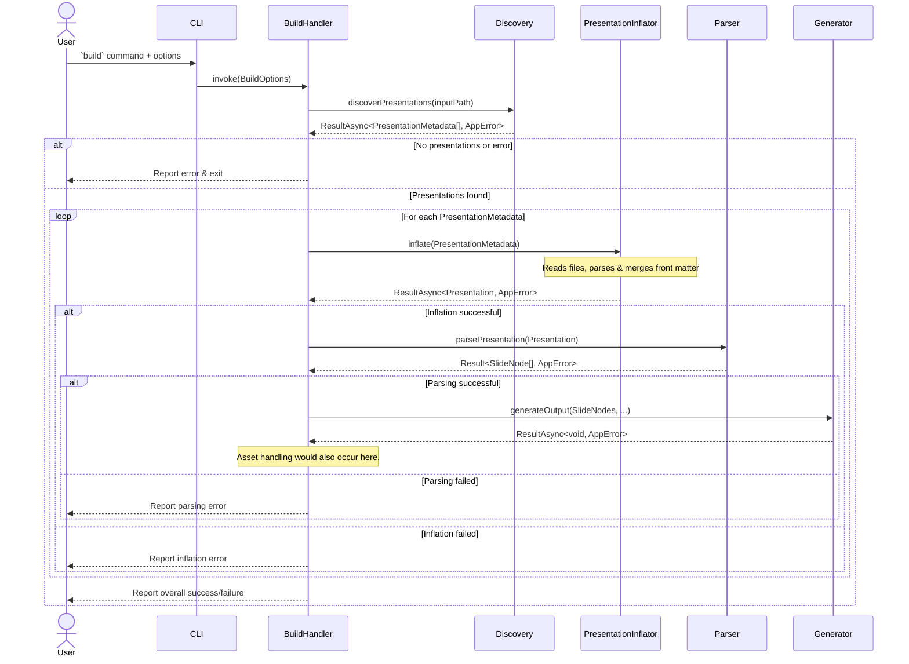
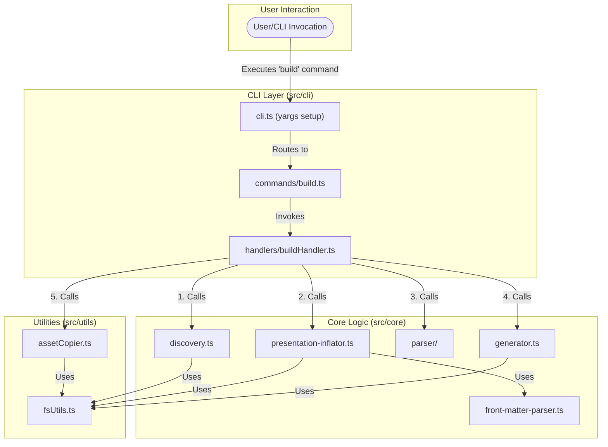

# System Design: CLI Slide Parser

## 1. Introduction

This document outlines the high-level design for a command-line interface (CLI) application responsible for parsing presentation slides from source files (MD/MDX) and generating output in various formats (HTML, MDX).

## 2. Overall Architecture

- **Type**: Command-Line Interface (CLI) application.
- **Framework**: `yargs` for parsing command-line arguments and managing commands.
- **Language**: TypeScript.
- **Core Principle**: Modular design with clear separation of concerns. Each module will have a specific responsibility.
- **Export Strategy**: Each module (typically a folder) will have an `index.ts` file that exports only the public-facing functions and types. Internal components will not be exported to maintain encapsulation.
- **Error Handling**: The `neverthrow` library will be used for robust error handling, avoiding traditional `try/catch` blocks and `throw` statements for expected errors. Functions will return `Result` or `ResultAsync` objects.

## 3. Folder Structure

```
parse-a-slide/
├── _docs/
│   └── 20-System-Design.md  // This document
├── src/
│   ├── cli/
│   │   ├── commands/
│   │   │   ├── build.ts       // Logic for the 'build' command
│   │   │   └── index.ts       // Exports command modules
│   │   ├── handlers/
│   │   │   ├── buildHandler.ts// Orchestrates the build process
│   │   │   └── index.ts       // Exports handler modules
│   │   ├── index.ts           // Exports CLI setup
│   │   └── cli.ts             // Main CLI entry point, yargs setup
│   ├── core/
│   │   ├── discovery.ts       // Discovers presentation and fragment files
│   │   ├── presentation-inflator.ts // Reads file content and processes front matter
│   │   ├── front-matter-parser.ts   // Utility for parsing and merging front matter
│   │   ├── parser/
│   │   │   ├── index.ts                    # Main parser orchestration with expanding array logic
│   │   │   ├── fragment-splitter.ts        # Content splitting by delimiters and level detection
│   │   │   ├── parser-utils.ts            # Utility functions for delimiter parsing and validation
│   │   │   └── slide-node-builder.ts      # Class-based slide creation and navigation linking
│   │   ├── generator.ts       // Generates output files (HTML/MDX)
│   │   ├── watcher.ts         // Handles file watching for live reloading
│   │   ├── processors/        // Directory for slide node processors
│   │   │   └── index.ts       // Exports processors
│   │   ├── types/             // Shared TypeScript types and interfaces
│   │   │   ├── index.d.ts
│   │   │   └── presentation.ts  // Definition for SlideNode, PresentationMetadata, etc.
│   │   └── index.ts           // Exports core modules
│   ├── utils/
│   │   ├── fsUtils.ts         // File system utilities (wrapping Node.js fs and glob)
│   │   ├── assetCopier.ts     // Utility for copying assets
│   │   └── index.ts           // Exports utility modules
│   └── index.ts               // Main application entry point (if needed, or re-exports cli.ts)
├── package.json
├── tsconfig.json
└── README.md
```

## 4. Core Components & Descriptions

### 4.1. CLI (`src/cli/`)

- **Responsibility**: Handles command-line argument parsing, command registration, and invoking the appropriate handlers.
- **Key Files**:
  - `cli.ts`: Main entry point for the CLI. Initializes `yargs`, defines commands, and maps them to handlers.
  - `commands/build.ts`: Defines the `build` command, its options (`input`, `output`, `format`), and calls the `buildHandler`.
  - `handlers/buildHandler.ts`: Orchestrates the entire build process. It receives parsed CLI arguments and coordinates the actions of `Discovery`, `Parser`, `Generator`, and `AssetCopier`.

### 4.2. Discovery (`src/core/discovery.ts`)

- **Responsibility**:
  - Takes an input directory path.
  - Uses `FSUtils` to find presentation files (e.g., `*.pres.md`, `*.pres.mdx`).
- **Dependencies**: `FSUtils`.
- **Output**: `ResultAsync<PresentationMetadata[], AppError>`

### 4.3. FSUtils (`src/utils/fsUtils.ts`)

- **Responsibility**:
  - Provides an abstraction layer over Node.js file system operations (`fs` module) and glob pattern matching (e.g., `glob` library).
  - All functions wrap their operations with `neverthrow` to return `Result` or `ResultAsync` objects, ensuring consistent error handling.
  - Functions include: reading files, writing files, checking file/directory existence, listing directory contents based on glob patterns.
- **Key Functions**:
  - `readFile(path: string): ResultAsync<string, AppError>`
  - `writeFile(path: string, content: string): ResultAsync<void, AppError>`
  - `findFiles(globPattern: string, cwd: string): ResultAsync<string[], AppError>`
- **Dependencies**: Node.js `fs`, `path`, `glob` library, `neverthrow`.

### 4.4. `PresentationInflator` (`src/core/presentation-inflator.ts`)

- **Responsibility**:
  - Takes `PresentationMetadata` from the `Discovery` stage.
  - Reads the content for the entry point and all fragment files using `FSUtils`.
  - Uses the `FrontMatterParser` to extract YAML front matter from the content.
  - Performs a simple merge: the entry point's front matter serves as a base, which is overridden by each fragment's specific front matter.
  - Produces a fully inflated `Presentation` object where each `Fragment` contains its clean content and final, merged front matter.
- **Dependencies**: `Discovery`, `FrontMatterParser`, `FSUtils`.
- **Output**: `ResultAsync<Presentation, AppError>`

### 4.5. `FrontMatterParser` (`src/core/front-matter-parser.ts`)

- **Responsibility**:
  - A stateless utility that wraps the `gray-matter` library.
  - Provides a `parse` function to separate front matter from content.
  - Provides a `merge` function to combine two front matter objects.
- **Dependencies**: `gray-matter`.

### 4.6. Parser (`src/core/parser/`)

- **Responsibility**:
  - Takes a fully inflated `Presentation` object from the `PresentationInflator`.
  - Transforms it into a flat, structured list of `SlideNode` objects with fully resolved navigation.
  - Does **not** perform any file I/O or front matter merging logic.
- **Input**: `presentation: Presentation`
- **Output**: `Result<SlideNode[], AppError>`

### 4.7. Generator (`src/core/generator.ts`)

- **Responsibility**:
  - Takes an array of `SlideNode` objects (the output from the `Parser`).
  - Takes the desired output `format` (`html` or `mdx`).
  - Generates the output file(s) in the specified format.
  - Uses `FSUtils` to write the generated content to the output directory.
- **Input**:
  - `slideNodes: SlideNodes`
  - `format: 'html' | 'mdx'`
  - `outputDirectory: string`
- **Dependencies**: `FSUtils`.
- **Output**: `ResultAsync<void, AppError>`

### 4.8. Asset Copier (`src/utils/assetCopier.ts`)

- **Responsibility**:
  - Copies assets (e.g., images, videos) referenced in the presentations from their source locations to the appropriate target directory within the output structure.
  - Ensures relative links in the generated output remain valid.
  - May receive information about assets from the `SlideNode`s (populated by `Parser` and its `Processors`).
- **Input**:
  - `assetsToCopy: { sourcePath: string, targetPath: string }[]` (derived from `SlideNode.assets` or other means)
  - `outputDirectory: string`
- **Dependencies**: `FSUtils`.
- **Output**: `ResultAsync<void, AppError>`

## 5. Data Flow / Order of Operations (Build Command)

This section outlines the high-level sequence of operations when the `build` command is executed. The architecture follows a clean, three-stage pipeline: **Discover -> Inflate -> Parse**.

1.  **CLI Invocation & Options Parsing**:
    - User executes the `build` command.
    - `CLI` (via `yargs`) parses arguments and invokes `BuildHandler`.

2.  **`BuildHandler` Orchestration**:
    - `BuildHandler` receives `BuildOptions` and coordinates the entire build workflow.

3.  **Stage 1: Discovery (`Discovery`)**:
    - `BuildHandler` calls `Discovery.discoverPresentations(buildOptions.inputPath)`.
    - `Discovery` uses `FSUtils` to find presentation files and constructs `PresentationMetadata` for each, containing only file path information.
    - Returns `ResultAsync<PresentationMetadata[], AppError>`.

4.  **Processing Loop Initiation (`BuildHandler`)**:
    - `BuildHandler` iterates through each `PresentationMetadata` returned from the Discovery stage.

5.  **Per-Presentation Processing (`BuildHandler`)**: For each `PresentationMetadata` object:

    a. **Stage 2: Inflation (`PresentationInflator`)**: `BuildHandler` calls `PresentationInflator.inflate(metadata)`.
    - `PresentationInflator` reads all necessary files using `FSUtils`.
    - It calls `FrontMatterParser` to extract and merge front matter.
    - Returns `ResultAsync<Presentation, AppError>` with a fully inflated `Presentation` object where fragments contain their content and final front matter.

    b. **Stage 3: Parsing (`Parser`)**: If inflation is successful, `BuildHandler` calls `Parser.parsePresentation(inflatedPresentation)`.
    - `Parser` processes the in-memory `Presentation` object to create a flat list of `SlideNode` objects with navigation.
    - Returns `Result<SlideNode[], AppError>`.

    c. **Output Generation (`Generator`)**: If parsing is successful, `BuildHandler` calls `Generator.generateOutput(...)`.

    d. **Asset Handling (`AssetCopier`)**: `BuildHandler` calls `AssetCopier.processAssets(...)`.

6.  **Completion Reporting (`BuildHandler`)**:
    - After processing all presentations, `BuildHandler` reports the final status to the user.

### Sequence Diagram



### System Interaction Diagram (Component Overview)

This diagram provides a higher-level overview of the main components and their primary interactions within the system.



## 6. Error Handling Strategy

- **Library**: `neverthrow`.
- **Core Principle**: Functions that can fail in a predictable way (e.g., file not found, parsing error) will return a `Result<T, E>` or `ResultAsync<T, E>` object instead of throwing exceptions.
  - `T` is the type of the success value.
  - `E` is the type of the error value (e.g., a custom `AppError` object/class with a `code` and `message`).
- **Public Functions**: All public-facing functions within modules (especially in `core` and `utils`) should adhere to this pattern.
- **Error Propagation**: Errors are propagated up the call stack via the `Result` objects. Handlers (like `buildHandler`) are responsible for `match`-ing on the result and deciding how to proceed or report errors.
- **No `try/catch` for Expected Errors**: Avoid `try/catch` for business logic errors. `try/catch` may still be used at the very top level (e.g., in `cli.ts`) to catch truly unexpected exceptions.

## 7. Logging

A central logger utility will be implemented to handle all application output directed to the user. This logger will provide a consistent way to communicate information, warnings, errors, and debugging details.

- **Log Levels**: The logger will support standard log levels:
  - `error`: For critical errors that prevent normal operation.
  - `info`: For general information about the application's progress and significant events (e.g., presentations found, files generated).
  - `debug`: For detailed diagnostic information useful for development and troubleshooting.
- **CLI Control**: The active log level will be configurable via CLI parameters `--verbose`/`-v` flag for debug and `--quiet` to suppress info.
- **Usage**: All modules should use this logger for any communication to the console. This includes progress updates, successful operations, warnings, and errors (especially those derived from `neverthrow` `Result` objects).
- **Mocking**: The logger interface should be designed to be easily mockable for testing purposes, allowing tests to assert logging behavior without capturing stdout/stderr directly if not desired.

## 8. Testing Strategy

The testing approach aims for robust coverage by focusing on module interactions and real file system operations where practical, minimizing the reliance on mocks for core logic.

- **Combined Unit/Integration Tests**

  - There will be no strict delineation between traditional unit and integration tests for module testing. Tests will target the public interface of a module (e.g., a function exported from `discovery.ts` or `parser.ts`).
  - These tests will execute the code path through its internal logic and interactions with direct dependencies (e.g., `FSUtils` calls from `Discovery`).
  - **Testing Utility**: A dedicated testing utility will be developed. This utility will accept a configuration object to dynamically create and manage temporary file and directory structures on disk for test scenarios. This allows tests to operate on actual files, providing more realistic testing conditions.
  - **Mocking**: Mocks will be minimized. The primary candidate for mocking will be the `Logger` to control and verify output during tests.
  - Tests will be written using Vitest.

- **End-to-End (E2E) Tests**

  - A separate suite of E2E tests will be maintained.
  - These tests will invoke the CLI application directly using `child_process` or a similar mechanism.
  - Assertions will be made on the actual output files created in a temporary directory, exit codes, and console output (stdout/stderr) captured from the CLI process.
  - E2E tests will cover various command-line option combinations and overall application behavior from the user's perspective.

- **Error Handling Tests**
  - Specific tests will ensure that `neverthrow` `Result` objects are correctly returned for expected error conditions (e.g., file not found, parsing errors) and that these errors are appropriately handled and reported by the consuming modules or the CLI.
