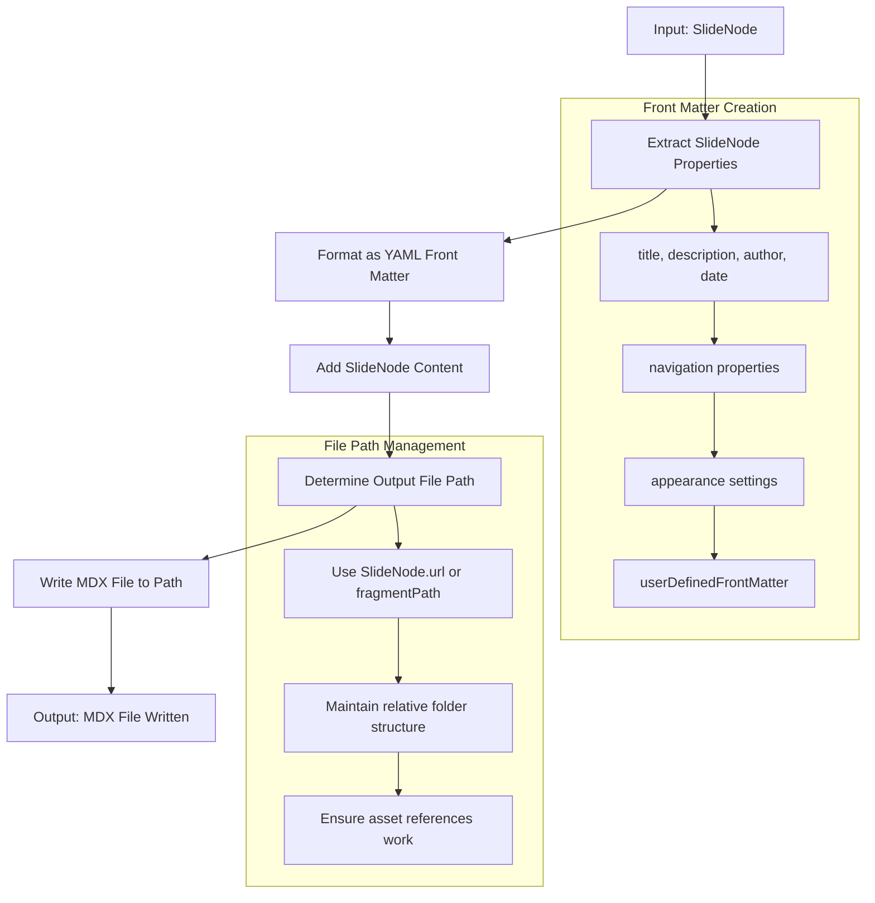

# Feature: F11 - Basic Generator (MDX) - Technical Design

**Purpose**: This document provides the detailed technical specifications for the Basic Generator (MDX) feature. It includes a technical overview, implementation details for all affected modules and types, and comprehensive test scenarios.

## 1. Feature Overview

The Basic Generator (MDX) feature implements a straightforward transformation from `SlideNode` objects into MDX format files. The core functionality takes a `SlideNode`'s properties (title, description, navigation, appearance, etc.) and formats them as YAML front matter, then appends the slide's content to create a complete MDX file.

The MDX generator integrates into the existing `Generator` module, leveraging `FSUtils` for file operations. Since all asset references use relative paths and navigation metadata is already present in the `SlideNode`, no additional processing or resolution is required - the generator simply serializes the existing data into MDX format.

## 2. System / User Flow



## 3. Change Summary Table

| Module/File Path | Item Name | Status | Description |
| :--- | :--- | :--- | :--- |
| `src/core/generator.ts` | `toMdx` | `New` | A new function that converts a `SlideNode` object to an MDX file string. |
| `src/types/index.ts` | `Generator` | `New` | A new type definition for the generator function. |

## 4. Implementation Details

### 4.1. `generator` Module (`src/core/generator.ts`)

- **Status**: New
- **New Function**:
  - **`toMdx(slideNode: SlideNode): string`**
    - **Purpose**: Converts a `SlideNode` object into a string representation of an MDX file. This includes generating the YAML front matter from the slide's metadata and appending the slide's content.
    - **Implementation Approach**:
      - The function will accept a single `SlideNode` object as its parameter.
      - It will construct a JavaScript object for the front matter, pulling properties from `slideNode.frontMatter` and `slideNode.navigation`.
      - Any `userDefinedFrontMatter` will be merged into this object.
      - The `js-yaml` library will be used to serialize the front matter object into a YAML string.
      - The final output will be a string that concatenates the YAML front matter (enclosed in `---` delimiters) and the `slideNode.content`.
    - **Pseudocode**:
      ```pseudocode
      FUNCTION toMdx(slideNode):
          frontMatter = {}

          IF slideNode.frontMatter.title THEN frontMatter.title = slideNode.frontMatter.title
          IF slideNode.frontMatter.description THEN frontMatter.description = slideNode.frontMatter.description
          // ... and so on for other standard front matter fields

          // Add navigation properties
          frontMatter.navigation = slideNode.navigation

          // Merge user-defined front matter
          IF slideNode.frontMatter.userDefinedFrontMatter THEN
              frontMatter = { ...frontMatter, ...slideNode.frontMatter.userDefinedFrontMatter }
          END IF

          yamlString = toYaml(frontMatter)
          mdxContent = "---
" + yamlString + "---

" + slideNode.content

          RETURN mdxContent
      END FUNCTION
      ```
    - **Error Handling**: The function will assume valid inputs as per the system design. No special error handling is required for this basic implementation.

### 4.2. New/Updated Types (`src/types/index.ts`)

1. **`Generator` Type:**
   - **Purpose**: Defines the signature for the generator function.
   - **Structure**:
     ```typescript
     import { SlideNode } from './slide';

     export type Generator = (slideNode: SlideNode) => string;
     ```

## 5. Test Scenarios (Gherkin)

```gherkin
Feature: F11 - Basic Generator (MDX)

  As a developer,
  I want to transform a SlideNode object into an MDX file,
  So that the presentation can be rendered in an MDX-based environment.

  #---------------------------------------------------------------------------
  # Module: Generator
  # Function: toMdx
  #---------------------------------------------------------------------------

  @happyPath @status_pending
  Scenario: Generate a standard MDX file from a complete SlideNode
    Given a SlideNode with a title, description, content, and navigation properties
    When the toMdx function is called with the SlideNode
    Then an MDX file content is generated
    And the content contains YAML front matter with title, description, and navigation
    And the content includes the original slide content after the front matter.

  @happyPath @status_pending
  Scenario: Generate an MDX file for a slide fragment
    Given a SlideNode that is a fragment with a fragmentPath
    When the toMdx function is called with the SlideNode
    Then an MDX file content is generated
    And the output path is based on the fragmentPath property.

  @edgeCase @status_pending
  Scenario: Generate an MDX file from a SlideNode with only a title and content
    Given a SlideNode with only a title and content
    When the toMdx function is called with the SlideNode
    Then an MDX file content is generated
    And the front matter contains only the title
    And the slide content is present.

  @edgeCase @status_pending
  Scenario: Generate an MDX file from a SlideNode with no content
    Given a SlideNode with front matter properties but no content
    When the toMdx function is called with the SlideNode
    Then an MDX file content is generated
    And the file consists only of YAML front matter.

  @happyPath @status_pending
  Scenario: Generate an MDX file including user-defined front matter
    Given a SlideNode with standard properties and additional userDefinedFrontMatter
    When the toMdx function is called with the SlideNode
    Then an MDX file content is generated
    And the front matter includes both the standard properties and the user-defined fields.