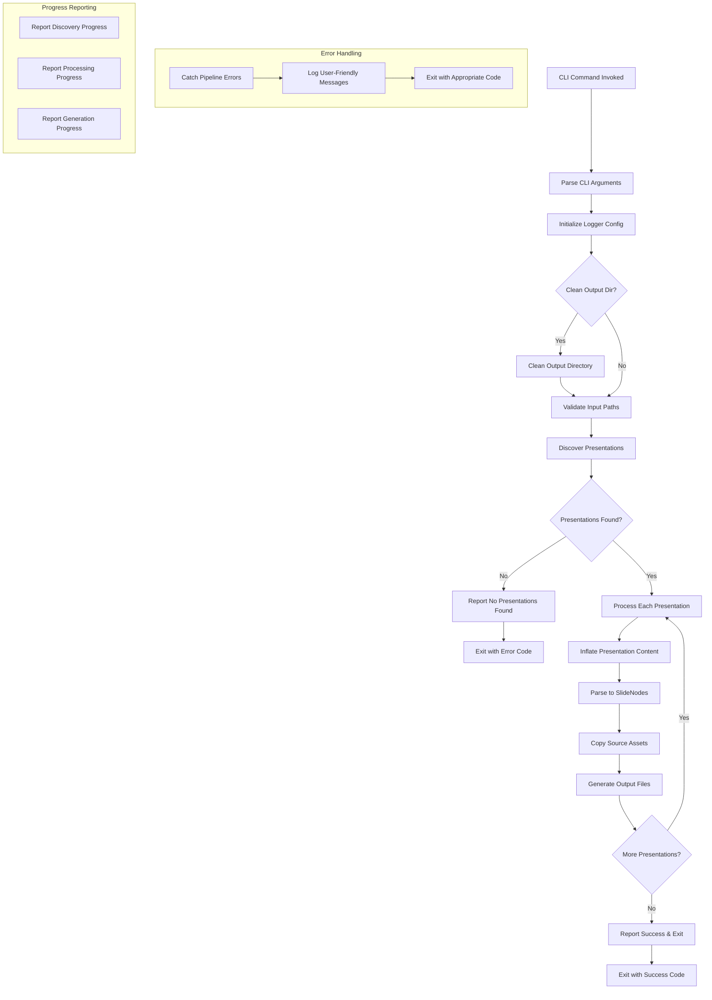

# Feature: CLI Integration & Build Pipeline - Technical Design

**Purpose**: This document provides the detailed technical specifications for the CLI Integration & Build Pipeline feature. It includes a technical overview, implementation details for all affected modules and types, and comprehensive test scenarios.

## 1. Feature Overview

The CLI Integration & Build Pipeline feature completes the parse-a-slide application by implementing the missing orchestration layer that connects all existing core components through the CLI interface. The primary component is the `buildHandler` function, which serves as the main coordinator that sequences the entire presentation processing pipeline from input discovery to output generation.

This feature integrates the existing modular components (`Discovery`, `PresentationInflator`, `Parser`, `AssetCopier`, and `Generator` modules) into a cohesive workflow controlled by CLI options. The implementation includes comprehensive error handling with user-friendly messages, progress reporting for multi-presentation builds, output directory management, and optional watch mode functionality using the existing `chokidar` dependency. The design maintains the established `neverthrow` error handling pattern and modular architecture while providing the missing glue code to make parse-a-slide a fully functional CLI application.

## 2. System / User Flow



## 3. Change Summary Table

| File/Module | Change Type | Description |
|-------------|-------------|-------------|
| `src/cli/handlers/build-handler.ts` | Major Update | Complete implementation of `buildHandler` function to orchestrate the full build pipeline |
| `src/utils/logger.ts` | Minor Update | Add simple CLI option mapping function (`configureLoggerFromCLI`) |
| `src/types/cli.ts` | Minor Update | Add progress reporting callback type definitions |
| `src/utils/validation.ts` | New File | Add input validation utilities that leverage existing `fs-utils` functions |
| `src/utils/progress-reporter.ts` | New File | Implement progress reporting for multi-presentation builds |

## 4. Implementation Details

### 4.1. Build Handler Implementation (`src/cli/handlers/build-handler.ts`)

The core `buildHandler` function will be completely implemented to orchestrate the entire build pipeline:

**Pipeline Orchestration:**
- Initialize logger configuration based on `options.verbose` and `options.quiet` flags
- Validate input paths and output directory permissions using new validation utilities
- Clean output directory if `options.clean` is true using enhanced `fs-utils`
- Use `Discovery` module to find presentations from input patterns/paths
- Process each discovered presentation through the complete pipeline:
  - Use `PresentationInflator` to load and inflate presentation content
  - Use `Parser` to convert presentations into `SlideNodes`
  - Use `AssetCopier` to handle source assets during build process
  - Use appropriate `Generator` module (MDX/HTML) based on format option
- Implement comprehensive error handling with user-friendly messages
- Report progress for multi-presentation builds using progress reporter
- Return appropriate exit codes for success/failure scenarios

**Error Handling Strategy:**
- Wrap all pipeline operations in `neverthrow` Result types following existing patterns
- Catch and transform technical errors into user-friendly messages
- Continue processing valid presentations when encountering errors in multi-presentation builds
- Log specific file locations and error details for debugging

### 4.2. Logger Configuration Enhancement (`src/utils/logger.ts`)

**New Functions:**
- `configureLoggerFromCLI(options: { verbose: boolean, quiet: boolean })`: Simple utility to map CLI flags to existing LogLevel enum values
- Uses existing `Logger.getInstance().setLevel()` method
- Maps: `quiet` → ERROR level, `verbose` → DEBUG level, default → INFO level

### 4.3. Input Validation (`src/utils/validation.ts`)

**New Module:**
- `validateInputPaths(paths: string[]): ResultAsync<string[], AppError>`: Validate input paths exist and are accessible using existing `pathExists()`
- `validateBuildOptions(options: BuildCommandOptions): ResultAsync<void, AppError>`: Comprehensive option validation
- `prepareOutputDirectory(path: string): ResultAsync<void, AppError>`: Combines existing `ensureDir()` and `cleanDir()` functions based on clean option
- Follow existing error handling patterns with descriptive error messages
- Leverages existing `fs-utils` functions: `pathExists()`, `ensureDir()`, `cleanDir()`

### 4.4. Progress Reporting (`src/utils/progress-reporter.ts`)

**New Module:**
- `ProgressReporter` class: Track and report build progress for multiple presentations
- `reportDiscovery(count: number)`: Report number of presentations discovered
- `reportProcessingStart(presentationName: string)`: Report start of presentation processing
- `reportProcessingComplete(presentationName: string)`: Report completion of presentation processing
- `reportOverallProgress(current: number, total: number)`: Report overall build progress
- Integration with logger to respect verbose/quiet settings

### 4.5. CLI Integration Points

**Build Command Handler Integration:**
- The existing `buildHandler` stub will be replaced with the complete implementation
- All CLI options (`input`, `outputDir`, `format`, `clean`, `verbose`, `quiet`) will be properly handled
- Uses existing `AppError` and `ErrorCode` infrastructure from `src/utils/error.ts`
- Exit codes will be mapped from `ErrorCode` values for CI/CD integration
- Help and version information will be properly displayed through existing yargs configuration

**Error Handling Integration:**
- Leverages existing comprehensive error infrastructure (`AppError`, `ErrorCode`, `createError`)
- Uses existing `neverthrow` patterns (`PasAsyncResult`, `ok`, `err`) throughout pipeline
- Simple utility functions for exit code mapping and user-friendly message formatting
- No new error handling modules needed - existing `error.ts` provides complete foundation

**Type System Integration:**
- New progress callback types will be added to `src/types/cli.ts`
- Existing error types (`AppError`, `ErrorCode`) are sufficient for all CLI error scenarios

## 5. Test Scenarios (Gherkin)

```gherkin
Feature: CLI Integration & Build Pipeline
  As a user of parse-a-slide
  I want to build presentations from source files via CLI
  So that I can generate output in my desired format

  @status_pending @status_complete
  Scenario: Successful single presentation build
    Given I have a valid presentation directory with "index.pres.md" and fragments
    When I run the build command with input path and output directory
    Then the build should complete successfully
    And the output directory should contain generated files in the specified format
    And the process should exit with code 0

  @status_pending @status_complete
  Scenario: Successful multi-presentation build with progress reporting
    Given I have multiple presentation directories with valid structure
    When I run the build command with multiple input paths
    Then the build should process each presentation in sequence
    And progress should be reported for each presentation
    And all output directories should contain generated files
    And the process should exit with code 0

  @status_pending @status_complete
  Scenario Outline: Build with different output formats
    Given I have a valid presentation directory
    When I run the build command with format "<format>"
    Then the output should be generated in "<format>" format
    And the process should exit with code 0

    Examples:
      | format |
      | mdx    |
      | html   |
      | md     |

  @status_pending @status_complete
  Scenario: Build with clean output directory option
    Given I have a valid presentation directory
    And the output directory already contains files
    When I run the build command with the clean option
    Then the output directory should be cleaned before building
    And new files should be generated
    And the process should exit with code 0

  @status_pending @status_complete
  Scenario: Build with verbose logging
    Given I have a valid presentation directory
    When I run the build command with verbose option
    Then detailed logging information should be displayed
    And the build should complete successfully
    And the process should exit with code 0

  @status_pending @status_complete
  Scenario: Build with quiet logging
    Given I have a valid presentation directory
    When I run the build command with quiet option
    Then only error messages should be displayed
    And the build should complete successfully
    And the process should exit with code 0

  @status_pending @status_complete
  Scenario: No presentations found in input directory
    Given I have a directory with no presentation files
    When I run the build command with that directory
    Then an appropriate error message should be displayed
    And the process should exit with a non-zero code

  @status_pending @status_complete
  Scenario: Invalid input directory path
    Given I specify a non-existent input directory
    When I run the build command
    Then a "directory not found" error should be displayed
    And the process should exit with a non-zero code

  @status_pending @status_complete
  Scenario: Output directory permission issues
    Given I have a valid presentation directory
    And the output directory has restricted write permissions
    When I run the build command
    Then a permission error should be displayed
    And the process should exit with a non-zero code

  @status_pending @status_complete
  Scenario: Malformed presentation file handling
    Given I have a presentation directory with malformed YAML front matter
    When I run the build command
    Then a user-friendly parsing error should be displayed
    And the specific file and error location should be indicated
    And the process should exit with a non-zero code

  @status_pending @status_complete
  Scenario: Asset copying during build process
    Given I have a presentation directory with image assets
    When I run the build command
    Then the presentation should be processed successfully
    And the assets should be copied to the output directory
    And asset references should be maintained in the output
    And the process should exit with code 0

  @status_pending @status_complete
  Scenario: Build pipeline error recovery
    Given I have multiple presentations where one has errors
    When I run the build command
    Then the valid presentations should be processed successfully
    And errors for the invalid presentation should be reported
    And the process should continue with remaining presentations
    And the process should exit with a non-zero code due to errors

  @status_pending @status_complete
  Scenario: CLI help and version information
    When I run the CLI with the help option
    Then usage information and available commands should be displayed
    And the process should exit with code 0

  @status_pending @status_complete
  Scenario: Build command help information
    When I run the build command with the help option
    Then detailed build command options should be displayed
    And examples should be provided
    And the process should exit with code 0
```
