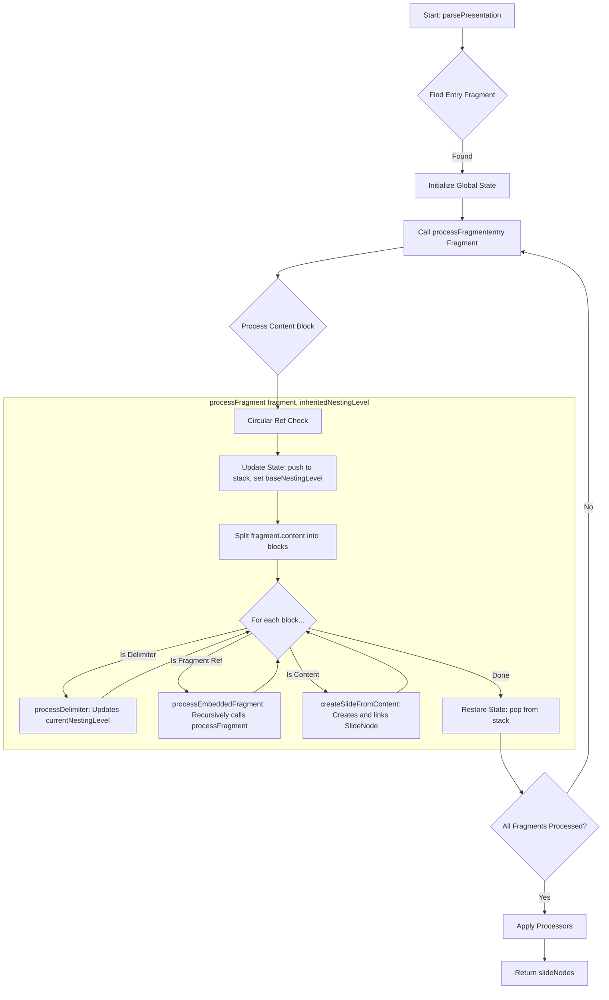

# Feature Design: F7 - Core Parser Implementation

## 1. Overview

The `Parser` module transforms a `Presentation` object into a flat, structured list of `SlideNode` objects with fully resolved navigation. This involves recursively parsing `Fragment` content, interpreting hierarchical delimiters (`---`, `--->`, etc.), handling embedded fragment references, and creating `SlideNode`s with correct navigation links.

This feature will deliver:

-   **S1**: A `Parser` that outputs a `Result<SlideNode[], AppError>`.
-   **S2**: Handling of slide structures demarcated by `---` and `--->`.
-   **S3**: Support for an extensible `Processor` pipeline.
-   **S4**: Support for embedding content from other `.pres` fragments.

## 2. Implementation Details

### 2.1. Input

The `Parser` will expose a function, `parse`, that accepts:

1.  `presentation: Presentation`
2.  `processors: Processor[]`: An array of `Processor` instances.

### 2.2. Parsing Process

The parser uses a state-driven, recursive approach. A central `globalState` object tracks the hierarchy, nesting levels, and parent-child relationships as content is processed, allowing navigation links to be established immediately upon slide creation.

#### High-Level Flowchart



### 2.2.1. Pseudo-Code Implementation

The following pseudo-code illustrates the high-level flow and logic.

#### Key Global State

A single state object is maintained throughout the parsing process.

```
globalState = {
  slideNodes: [],                  // Final flat list of all created slides
  baseNestingLevel: 0,             // The nesting level inherited by the current fragment context
  currentNestingLevel: 0,          // The current effective nesting depth
  parentStack: [],                 // A stack where parentStack[level] stores the ID of the parent at that level
  lastSlideAtLevel: {},            // A map where lastSlideAtLevel[level] stores the ID of the last slide at that level
  fragmentProcessingStack: [],     // A stack to detect circular fragment references
  slideCounters: {}                // A map to generate unique slide IDs
}
```

#### Main Parsing Flow

```
function parsePresentation(presentation, processors):
  initializeGlobalState()
  entryFragment = findEntryFragment(presentation)
  fragmentMap = createFragmentMap(presentation.fragments)
  processFragment(entryFragment, fragmentMap, 0) // Start with base nesting level 0

  // Post-process to finalize navigation
  finalizeNavigation(globalState.slideNodes)

  applyProcessors(globalState.slideNodes, processors)
  return globalState.slideNodes

function finalizeNavigation(slideNodes):
  // Create a map for quick lookup
  slideMap = mapById(slideNodes)
  
  // Link last child's 'next' to parent's 'next'
  for slide in slideNodes:
    if slide.navigation.parentSlideId and not slide.navigation.nextSlideId:
      parent = slideMap.get(slide.navigation.parentSlideId)
      if parent:
        slide.navigation.nextSlideId = parent.navigation.nextSlideId

  clearDeeperLevels(globalState.lastSlideAtLevel, from=level + 1)
```

#### Fragment Processing

This function handles a single fragment, including circular reference checks and managing the nesting context.

```
function processFragment(fragment, fragmentMap, inheritedNestingLevel):
  // 1. Circular Reference Check
  if globalState.fragmentProcessingStack.includes(fragment.relativePath):
    throw Error("Circular reference detected")

  // 2. Update State
  globalState.fragmentProcessingStack.push(fragment.relativePath)
  savedBaseNestingLevel = globalState.baseNestingLevel
  globalState.baseNestingLevel = inheritedNestingLevel

  // 3. Process Content
  contentBlocks = splitContent(fragment.content)
  for block in contentBlocks:
    if isDelimiter(block):
      processDelimiter(block)
    else if isFragmentReference(block):
      processEmbeddedFragment(block, fragmentMap)
    else:
      createSlideFromContent(block)

  // 4. Restore State
  globalState.baseNestingLevel = savedBaseNestingLevel
  globalState.fragmentProcessingStack.pop()
```

#### Delimiter and Nesting Logic

```
function processDelimiter(delimiterLine):
  if delimiterLine is "---":
    // Sibling: resets nesting to the base level of the current fragment
    globalState.currentNestingLevel = globalState.baseNestingLevel
  else:
    // Child: The number of '>' determines depth relative to the fragment's base
    relativeLevel = countCharacter(">", in: delimiterLine)
    newLevel = globalState.baseNestingLevel + relativeLevel
    
    // Validate that we are not skipping nesting levels
    maxAllowedLevel = (highest level in parentStack) + 1
    if newLevel > maxAllowedLevel:
      throw Error("Invalid nesting increase: cannot skip levels.")
    
    globalState.currentNestingLevel = newLevel
```

#### Embedded Fragment Handling

```
function processEmbeddedFragment(referenceBlock, fragmentMap):
  fragmentPath = resolveFragmentPath(referenceBlock.path)
  embeddedFragment = fragmentMap.get(fragmentPath)
  if !embeddedFragment:
    logWarning("Fragment reference not found: " + fragmentPath)
    return

  // Recursively process the new fragment.
  // CRUCIAL: The new fragment inherits the *current* nesting level as its *new base* level.
  processFragment(embeddedFragment, fragmentMap, globalState.currentNestingLevel)
```

#### Slide Creation

This function creates a `SlideNode` and links it into the structure.

```
function createSlideFromContent(content):
  // 1. Determine parent and previous slide from state
  level = globalState.currentNestingLevel
  parentId = (level > 0) ? globalState.parentStack[level - 1] : null
  previousSiblingId = globalState.lastSlideAtLevel[level]

  // 2. Create the new slide node
  newSlideId = generateSlideId(parentId)
  newSlide = create SlideNode with { id, content, navigation }
  globalState.slideNodes.push(newSlide)

  // 3. Link previous sibling and parent to the new slide
  if previousSiblingId:
    findSlideById(previousSiblingId).navigation.nextSlideId = newSlideId
  if parentId:
    parentSlide = findSlideById(parentId)
    if !parentSlide.navigation.childSlideId: // This is the first child
      parentSlide.navigation.childSlideId = newSlideId
  
  // 4. Update state for the next slide
  globalState.lastSlideAtLevel[level] = newSlideId
  globalState.parentStack[level] = newSlideId
  
  // 5. Clear any deeper, now invalid, nesting levels from the stack
  clearDeeperLevels(globalState.parentStack, from=level + 1)
  clearDeeperLevels(globalState.lastSlideAtLevel, from=level + 1)
```

### 2.3. `SlideNode` Structure (Target, from `_docs/10-Data-Model.md`)

**Crucial Changes**:

-   `navigation` must include `parentSlideId: string | null`.
-   `navigation.childSlideIds: string[]` is replaced by `navigation.childSlideId: string | null` (points to the first child).

```typescript
// Expected structure (src/core/types/presentation.ts)
export type SlideNode = {
  id: string
  // ... other properties
  navigation: {
    parentSlideId: string | null // Existing change
    previousSlideId: string | null
    nextSlideId: string | null
    childSlideId: string | null // << NEW (replaces childSlideIds)
  }
  content: string // Markdown/MDX content of the slide (after frontmatter)
  // ... other properties
}
```

### 3. System / User Flow

1.  **Invocation**: A handler (e.g., `BuildHandler`) calls `Parser.parse(presentation, processors)`.
2.  **Execution**:
    a. The `Parser` initializes its `globalState`.
    b. It begins a recursive process (`processFragment`) starting with the entry fragment.
    c. `processFragment` scans content, splitting it into blocks.
    d. Delimiters adjust the `currentNestingLevel`. Content blocks are turned into `SlideNode`s and linked immediately based on the current state.
    e. Fragment references trigger a recursive call to `processFragment`, passing the `currentNestingLevel` as the `inheritedNestingLevel` for the new context.
    f. After parsing, each `SlideNode` is passed through the `processorPipeline`.
    g. The `Parser` returns the final list of `SlideNode`s.

## 6. Key Assumptions, Behaviors, and Error Handling

### 6.1. General Parsing Behavior

-   **Parser Synchronicity**: The core parsing logic is **synchronous**. All fragment content is pre-loaded.
-   **Empty Nested Slides**: A structure like `Parent ---> ---> Child` will create an empty intermediate slide.

### 6.2. Hierarchical Delimiter Syntax & Level Sequencing

The nesting level of a slide is determined by its embedding context and the delimiter that creates it.

-   **`---` (Sibling Delimiter)**: Resets the `currentNestingLevel` to the `baseNestingLevel` of the current fragment context.
-   **`--->` (Child Delimiter)**: Sets the `currentNestingLevel` to `baseNestingLevel + N`, where N is the number of `>` characters.
-   **Error Condition**: The parser will throw an error if a delimiter attempts to create a slide at a level that is more than one level deeper than the current maximum depth (e.g., jumping from level 1 to level 3).

### 6.3. Fragment Reference Embedding

-   **Reference Identification**: A fragment reference is processed only if a line consists solely of a Markdown-style link to a `.pres.md` or `.pres.mdx` file.
-   **Lookup**: If a referenced fragment is not found, a warning is logged, and parsing continues.
-   **Contextual Embedding**: A referenced fragment **inherits the current nesting level** at the point of the reference. This becomes the `baseNestingLevel` for the new fragment context.

### 6.4. Circular Fragment Reference Detection

-   **Mechanism**: A `fragmentProcessingStack` tracks the chain of fragments being parsed. If a fragment is added to the stack that is already present, a circular reference is detected.
-   **Reuse**: This allows a fragment to be included multiple times, as long as it does not create a loop (e.g., `A -> B` and `C -> B` is valid; `A -> B -> A` is not).
-   **Error Handling**: A circular reference is a hard error that stops the parsing process.

## 7 Test Scenarios

This section outlines test scenarios for the Core Parser module using Gherkin syntax.

#### 7.1. Parser Module - Happy Path

##### Scenario Group: Basic Slide Creation & Navigation

-   [x] Scenario: Parsing a single slide from an entry fragment
    Given a Presentation with one entry Fragment "entry.pres.md"
    And the Fragment "entry.pres.md" contains:
    """
    # Slide 1
    Content for Slide 1.
    """
    When the Parser processes the Presentation
    Then the result should be successful
    And 1 SlideNode should be created
    And the SlideNode "S1" should have:
    | property                   | value                             |
    | -------------------------- | --------------------------------- |
    | content                    | "# Slide 1\nContent for Slide 1." |
    | navigation.parentSlideId   | null                              |
    | navigation.childSlideId    | null                              |
    | navigation.previousSlideId | null                              |
    | navigation.nextSlideId     | null                              |

-   [x] Scenario: Parsing multiple top-level sibling slides
    Given a Presentation with one entry Fragment "entry.pres.md"
    And the Fragment "entry.pres.md" contains:
    """
    # Slide 1
    ---
    # Slide 2
    ---
    # Slide 3
    """
    When the Parser processes the Presentation
    Then the result should be successful
    And 3 SlideNodes should be created with IDs "S1", "S2", "S3"
    And SlideNode "S1" should have navigation:
    | property        | value |
    | --------------- | ----- |
    | parentSlideId   | null  |
    | childSlideId    | null  |
    | previousSlideId | null  |
    | nextSlideId     | "S2"  |
    And SlideNode "S2" should have navigation:
    | property        | value |
    | --------------- | ----- |
    | parentSlideId   | null  |
    | childSlideId    | null  |
    | previousSlideId | "S1"  |
    | nextSlideId     | "S3"  |
    And SlideNode "S3" should have navigation:
    | property        | value |
    | --------------- | ----- |
    | parentSlideId   | null  |
    | childSlideId    | null  |
    | previousSlideId | "S2"  |
    | nextSlideId     | null  |

##### Scenario Group: Hierarchical Slide Creation & Navigation

-   [x] Scenario: Parsing a parent slide with one child
    Given a Presentation with one entry Fragment "entry.pres.md"
    And the Fragment "entry.pres.md" contains:
    """
    # Parent P1
    --->
    # Child C1
    """
    When the Parser processes the Presentation
    Then the result should be successful
    And 2 SlideNodes should be created with IDs "S1", "S1.C1"
    And SlideNode "S1" should have navigation:
    | property        | value   |
    | --------------- | ------- |
    | parentSlideId   | null    |
    | childSlideId    | "S1.C1" |
    | previousSlideId | null    |
    | nextSlideId     | null    |
    And SlideNode "S1.C1" should have navigation:
    | property        | value |
    | --------------- | ----- |
    | parentSlideId   | "S1"  |
    | childSlideId    | null  |
    | previousSlideId | null  |
    | nextSlideId     | null  |

-   [x] Scenario: Parsing multi-level child slides
    Given a Presentation with one entry Fragment "entry.pres.md"
    And the Fragment "entry.pres.md" contains:
    """
    # P1
    --->
    # P1.C1
    -->>
    # P1.C1.C1
    ---
    # P2
    """
    When the Parser processes the Presentation
    Then the result should be successful
    And 4 SlideNodes should be created with IDs "S1", "S1.C1", "S1.C1.C1", "S2"
    And SlideNode "S1" should have childSlideId "S1.C1" and nextSlideId "S2"
    And SlideNode "S1.C1" should have parentSlideId "S1", childSlideId "S1.C1.C1", and nextSlideId "S2"
    And SlideNode "S1.C1.C1" should have parentSlideId "S1.C1", childSlideId null, and nextSlideId "S2"
    And SlideNode "S2" should have parentSlideId null, childSlideId null, and previousSlideId "S1"

-   [x] Scenario: Parsing an empty intermediate child slide
    Given a Presentation with one entry Fragment "entry.pres.md"
    And the Fragment "entry.pres.md" contains:
    """
    # Parent P1
    ---
    ---
    # Sibling S2
    """
    When the Parser processes the Presentation
    Then the result should be successful
    And 3 SlideNodes should be created: "S1" (P1), "S2" (empty), "S3" (S2)
    And SlideNode "S2" should have content ""
    And SlideNode "S2" should have parentSlideId null and previousSlideId "S1" and nextSlideId "S3"

-   [x] Scenario: Last child's next slide links to parent's next slide
    Given a Presentation with one entry Fragment "entry.pres.md"
    And the Fragment "entry.pres.md" contains:
    """
    # S1
    --->
    # S1.C1
    ---
    # S2
    """
    When the Parser processes the Presentation
    Then the result should be successful
    And SlideNode "S1.C1" should have nextSlideId "S2"

##### Scenario Group: Fragment Embedding

-   [x] Scenario: Embedding a fragment as a sibling
    Given a Presentation with an entry Fragment "entry.pres.md" and another Fragment "include.pres.md"
    And Fragment "entry.pres.md" contains:
    """
    # Entry Slide 1
    [Details](./include.pres.md)
    # Entry Slide 2
    """
    And Fragment "include.pres.md" contains:
    """
    # Included Slide A
    ---
    # Included Slide B
    """
    When the Parser processes the Presentation
    Then the result should be successful
    And 4 SlideNodes should be created in order: "S1" (Entry 1), "S1FS1" (Incl A), "S1FS2" (Incl B), "S2" (Entry 2)
    And SlideNode "S1" should have nextSlideId "S1FS1"
    And SlideNode "S1FS1" should have parentSlideId null and previousSlideId "S1" and nextSlideId "S1FS2"
    And SlideNode "S1FS2" should have parentSlideId null and previousSlideId "S1FS1" and nextSlideId "S2"
    And SlideNode "S2" should have previousSlideId "S1FS2"

-   [x] Scenario: Embedding a fragment as a child
    Given a Presentation with an entry Fragment "entry.pres.md" and another Fragment "child.pres.md"
    And Fragment "entry.pres.md" contains:
    """
    # Parent Slide P1
    --->
    [Go To Child](./child.pres.md)
    ---
    # Sibling Slide S2
    """
    And Fragment "child.pres.md" contains:
    """
    # Child Content C1
    ---
    # Child Content C2
    """
    When the Parser processes the Presentation
    Then the result should be successful
    And 4 SlideNodes should be created: "S1" (P1), "S1.C1" (C1), "S1.C2" (C2), "S2" (S2)
    And SlideNode "S1" should have childSlideId "S1.C1" and nextSlideId "S2"
    And SlideNode "S1.C1" should have parentSlideId "S1" and nextSlideId "S1.C2"
    And SlideNode "S1.C2" should have parentSlideId "S1" and previousSlideId "S1.C1" and nextSlideId "S2"
    And SlideNode "S2" should have previousSlideId "S1"

-   [x] Scenario: Fragment reference not on its own line is ignored
    Given a Presentation with one entry Fragment "entry.pres.md"
    And Fragment "entry.pres.md" contains:
    """
    # Slide 1
    Some text [Details](./ignored.pres.md) and more text.
    """
    When the Parser processes the Presentation
    Then the result should be successful
    And 1 SlideNode "S1" should be created
    And its content should contain the full line "Some text [Details](./ignored.pres.md) and more text."

#### 2.4.2. Parser Module - Error Path & Warnings

##### Scenario Group: Entry Point Errors

-   [x] Scenario: No entry fragment specified
    Given a Presentation with fragments but no "entryId" in metadata
    When the Parser processes the Presentation
    Then the result should be an error with code "NO_ENTRY_FRAGMENT"

##### Scenario Group: Hierarchical Delimiter Sequencing Errors

-   [x] Scenario: Attempting to skip a delimiter level
    Given a Presentation with one entry Fragment "entry.pres.md"
    And Fragment "entry.pres.md" contains:
    """
    # Parent P1 (level 0)
    -->>
    # Child C1 (attempted level 2)
    """
    When the Parser processes the Presentation
    Then the result should be an error with code "PARSER_DELIMITER_SEQUENCE_ERROR"

##### Scenario Group: Fragment Embedding Issues

-   [x] Scenario: Referenced fragment not found
    Given a Presentation with an entry Fragment "entry.pres.md"
    And Fragment "entry.pres.md" contains:
    """
    # Slide 1
    [Link To Missing](./nonexistent.pres.md)
    """
    And the fragmentMap does not contain "nonexistent.pres.md"
    When the Parser processes the Presentation
    Then the result should be successful
    And a warning should be logged: "Fragment reference './nonexistent.pres.md' not found. Skipping."
    And only 1 SlideNode "S1" should be created

-   [x] Scenario: Circular fragment reference
    Given a Presentation with Fragment "fragA.pres.md" and "fragB.pres.md"
    And Fragment "fragA.pres.md" (entry) contains "[Link to B](./fragB.pres.md)"
    And Fragment "fragB.pres.md" contains "[Link to A](./fragA.pres.md)"
    When the Parser processes the Presentation
    Then the result should be an error with code "PARSER_CIRCULAR_REFERENCE"

