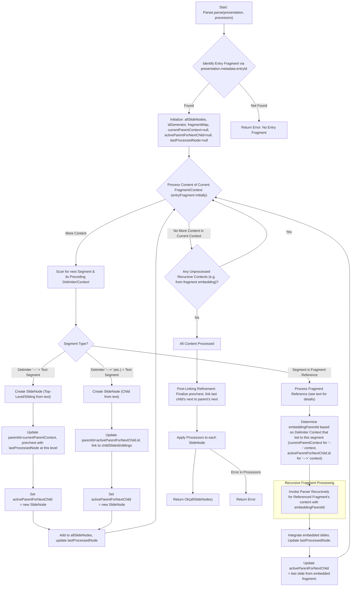

# Feature Design: F7 - Core Parser Implementation

## 1. Overview

The `Parser` module is a crucial component in the slide processing pipeline. Its primary responsibility is to take a `Presentation` object (containing `Fragment`s) and transform it into a flat, structured list of `SlideNode` objects with fully resolved navigation (parent, child, previous, next).

This transformation involves:

1.  Recursively parsing the content of each `Fragment`.
2.  Identifying slide segments based on hierarchical delimiters: `---` (sibling), `--->` (child), `-->>` (grandchild), etc.
3.  Detecting and processing Markdown references to other `.pres` fragments (e.g., `[text](./path/to/file.pres)`), embedding their parsed content hierarchically or sequentially.
4.  Creating a `SlideNode` for each effective slide, populating its content, and extracting `userDefinedFrontMatter`.
5.  Assigning unique, hierarchical, IDs to each `SlideNode`.
6.  Establishing comprehensive navigation links (`parentSlideId`, `childSlideId`, `previousSlideId`, `nextSlideId`) among all generated `SlideNode`s.
7.  Passing each finalized `SlideNode` through an extensible `Processor` pipeline.

This feature will deliver:

- **S1**: A `Parser` that accepts a `Presentation` object and outputs a `Result<SlideNode[], AppError>` containing a flat list of `SlideNode`s with resolved hierarchical and sequential navigation.
- **S2**: Handling of slide structures demarcated by `---` (sibling), `--->` (child), etc. Support for parsing frontmatter within these segments.
- **S3**: Support for an extensible `Processor` pipeline.
- **S4 (New)**: Support for detecting Markdown references to other `.pres` fragments and embedding their content, honoring the hierarchical context established by delimiters immediately preceding the reference or the line containing the reference.

## 2. Implementation Details

### 2.1. Input

The `Parser` will expose a function, `parse`, that accepts:

1.  `presentation: Presentation`: An object conforming to the structure defined in `_docs/10-Data-Model.md`.

    ```typescript
    // From _docs/10-Data-Model.md (src/core/types/presentation.ts)
    export type Presentation = {
      metadata: PresentationMetadata
      fragments: Fragment[] // Array of Fragment objects, assumed to be pre-loaded
    }

    export type Fragment = {
      metadata: FragmentMetadata
      content: string // Raw content of the fragment file
    }
    ```

2.  `processors: Processor[]`: An array of `Processor` instances.

### 2.2. Parsing Process

The core of the parser will be a recursive function, let's call it `processContentRecursive`, that handles a chunk of Markdown content and its context (like current parent ID, previous sibling ID).

**State Management during Parsing:**

- `allSlideNodes`: A flat list where all created `SlideNode` objects are stored.
- `idGenerator`: A utility to generate unique, hierarchical IDs (e.g., `F1S1`, `F1S1.C1`, `F1S2`).
- `fragmentMap`: A map of `fragment.metadata.relativePath` to `Fragment` object for quick lookup when resolving references.

**Main Parsing Loop (`parse` function):**

1.  Initialize `allSlideNodes = []`.
2.  Build `fragmentMap` from `presentation.fragments` for quick lookup of referenced fragments.
3.  **Identify Entry Fragment**: Determine the primary entry fragment from `presentation.fragments` based on the `entryId` attribute in `presentation.metadata`.
4.  If no entry fragment is found, return an appropriate error (e.g., `Err(createError('No entry fragment found', ErrorCode.PARSER_ERROR))`).
5.  For the entry fragment:
    - Parse its frontmatter (if any) from the beginning of `entryFragment.content`. Let this be `entryFragmentFrontmatter`.
    - The remaining content (after frontmatter) is `entryFragmentSlideContent`.
    - Call `processFragmentContent(entryFragmentSlideContent, entryFragmentFrontmatter, null, null, entryFragment.metadata, fragmentMap, allSlideNodes, idGenerator)`.
6.  **Post-Linking Refinement**: After the initial parsing has populated `allSlideNodes` and established `parentSlideId` and `childSlideId` links:
    1.  **Sibling Linking**: Iterate through `allSlideNodes`. For each node, identify its siblings (nodes with the same `parentSlideId`). Based on their order of appearance (which should be preserved from parsing):
        - Set `previousSlideId` for each node to its preceding sibling, if one exists.
        - Set `nextSlideId` for each node to its succeeding sibling, if one exists. At this point, the last sibling in any sequence will have `nextSlideId: null`.
    2.  **Last Child to Parent's Next Linking**: Iterate through `allSlideNodes` again. For each node `C`:
        - If `C.navigation.parentSlideId` is not `null` (so `C` is a child slide) AND `C.navigation.nextSlideId` is currently `null` (meaning `C` was the last in its direct sibling sequence from step 1):
          - Find `C`'s parent node `P` (using `C.navigation.parentSlideId` to look up in `allSlideNodes` or a map).
          - Set `C.navigation.nextSlideId = P.navigation.nextSlideId`.
7.  **Processor Pipeline**: Apply processors to each node in `allSlideNodes`.
8.  Return `Ok(allSlideNodes)`.

**Core Parsing Logic (Conceptual: `processFragmentContent`):**

This function (or equivalent iterative logic) is responsible for parsing the slide content *of a single fragment*, applying its pre-parsed `fragmentFrontmatter` to all slides generated from it.

The detailed logic for segmenting content by delimiters, handling hierarchical levels, and embedding *other* fragments (which would themselves have their own frontmatter parsed before their content is processed) is visually represented in the "High-Level Parsing Flow" diagram below and specified in detail in Section 6. When a `SlideNode` is created from a segment of this fragment's content, its `userDefinedFrontMatter` field is populated with `fragmentFrontmatter`.

When embedding another fragment, the main loop would first parse the embedded fragment's own frontmatter, then call `processFragmentContent` for its content, passing the embedded fragment's specific frontmatter.

**High-Level Parsing Flow:**



**ID Generation**: Example: `S1`, `S1.C1`. For slides embedded from a fragment (e.g., 'details.pres'), IDs could be `ParentID.detailsS1`, `ParentID.detailsS1.C1`, etc. The `idGenerator` will need to manage unique ID generation incorporating parent context and potentially a prefix derived from the embedded fragment's name to ensure uniqueness and traceability.

### 2.3. `SlideNode` Structure (Target, from `_docs/10-Data-Model.md`)

**Crucial Changes**:

- `navigation` must include `parentSlideId: string | null`.
- `navigation.childSlideIds: string[]` is replaced by `navigation.childSlideId: string | null` (points to the first child).
  These changes also need to be reflected in `_docs/10-Data-Model.md`.

```typescript
// Expected structure (src/core/types/presentation.ts)
export type SlideNode = {
  id: string
  url: string // e.g., /presentation-name/S1
  title?: string
  description?: string
  date?: string
  author?: object | string // { name, email?, website? } or string
  navigation: {
    parentSlideId: string | null // Existing change
    previousSlideId: string | null
    nextSlideId: string | null
    childSlideId: string | null // << NEW (replaces childSlideIds)
  }
  userDefinedFrontMatter: Record<string, any> // Parsed YAML from slide segment
  appearance?: {
    // Derived from userDefinedFrontMatter
    theme?: string
    transition?: string
    backgroundImage?: string
    layout?: string
    timing?: { duration?: number; autoAdvance?: boolean }
    [key: string]: any // Other rendering-specific attributes
  }
  content: string // Markdown/MDX content of the slide (after frontmatter)
  assets: Asset[] // Populated by processors or later stages
}

export type Asset = {
  id: string
  relativePath: string
  content: string // e.g., base64 data
}
```

### 2.4. Output

`Result<SlideNode[], AppError>`: A flat array of `SlideNode`s, fully linked.

### 2.5. Test Scenarios

This section outlines test scenarios for the Core Parser module using Gherkin syntax.

#### 2.5.1. Parser Module - Happy Path

##### Scenario Group: Basic Slide Creation & Navigation

- [x] Scenario: Parsing a single slide from an entry fragment
  Given a Presentation with one entry Fragment "entry.pres.md"
  And the Fragment "entry.pres.md" contains:
    """
    # Slide 1
    Content for Slide 1.
    """
  When the Parser processes the Presentation
  Then the result should be successful
  And 1 SlideNode should be created
  And the SlideNode "S1" should have:
    | property            | value    |
    | content             | "# Slide 1\nContent for Slide 1." |
    | navigation.parentSlideId | null     |
    | navigation.childSlideId  | null     |
    | navigation.previousSlideId | null     |
    | navigation.nextSlideId   | null     |
    | delimiterLevel      | 0        |

- [x] Scenario: Parsing multiple top-level sibling slides
  Given a Presentation with one entry Fragment "entry.pres.md"
  And the Fragment "entry.pres.md" contains:
    """
    # Slide 1
    ---
    # Slide 2
    ---
    # Slide 3
    """
  When the Parser processes the Presentation
  Then the result should be successful
  And 3 SlideNodes should be created with IDs "S1", "S2", "S3"
  And SlideNode "S1" should have navigation:
    | property            | value    |
    | parentSlideId       | null     |
    | childSlideId        | null     |
    | previousSlideId     | null     |
    | nextSlideId         | "S2"     |
  And SlideNode "S2" should have navigation:
    | property            | value    |
    | parentSlideId       | null     |
    | childSlideId        | null     |
    | previousSlideId     | "S1"     |
    | nextSlideId         | "S3"     |
  And SlideNode "S3" should have navigation:
    | property            | value    |
    | parentSlideId       | null     |
    | childSlideId        | null     |
    | previousSlideId     | "S2"     |
    | nextSlideId         | null     |

##### Scenario Group: Hierarchical Slide Creation & Navigation

- [ ] Scenario: Parsing a parent slide with one child
  Given a Presentation with one entry Fragment "entry.pres.md"
  And the Fragment "entry.pres.md" contains:
    """
    # Parent P1
    --->
    # Child C1
    """
  When the Parser processes the Presentation
  Then the result should be successful
  And 2 SlideNodes should be created with IDs "S1", "S1.C1"
  And SlideNode "S1" should have navigation:
    | property            | value    |
    | parentSlideId       | null     |
    | childSlideId        | "S1.C1"  |
    | previousSlideId     | null     |
    | nextSlideId         | null     | # As S1.C1 is its only descendant in this path
  And SlideNode "S1" should have delimiterLevel 0
  And SlideNode "S1.C1" should have navigation:
    | property            | value    |
    | parentSlideId       | "S1"     |
    | childSlideId        | null     |
    | previousSlideId     | null     |
    | nextSlideId         | null     | # Parent S1 has no next sibling
  And SlideNode "S1.C1" should have delimiterLevel 1

- [ ] Scenario: Parsing multi-level child slides
  Given a Presentation with one entry Fragment "entry.pres.md"
  And the Fragment "entry.pres.md" contains:
    """
    # P1
    --->
    # P1.C1
    -->>
    # P1.C1.C1
    ---
    # P2
    """
  When the Parser processes the Presentation
  Then the result should be successful
  And 4 SlideNodes should be created with IDs "S1", "S1.C1", "S1.C1.C1", "S2"
  And SlideNode "S1" should have childSlideId "S1.C1" and nextSlideId "S2"
  And SlideNode "S1.C1" should have parentSlideId "S1", childSlideId "S1.C1.C1", and nextSlideId "S2"
  And SlideNode "S1.C1" should have delimiterLevel 1
  And SlideNode "S1.C1.C1" should have parentSlideId "S1.C1", childSlideId null, and nextSlideId "S2"
  And SlideNode "S1.C1.C1" should have delimiterLevel 2
  And SlideNode "S2" should have parentSlideId null, childSlideId null, and previousSlideId "S1"

Scenario: Parsing an empty intermediate child slide
  Given a Presentation with one entry Fragment "entry.pres.md"
  And the Fragment "entry.pres.md" contains:
    """
    # Parent P1
    --->
    --->
    # Grandchild GC1
    """
  When the Parser processes the Presentation
  Then the result should be successful
  And 3 SlideNodes should be created: "S1" (P1), "S1.C1" (empty), "S1.C1.C1" (GC1)
  And SlideNode "S1.C1" should have content "" or be an empty slide marker
  And SlideNode "S1.C1" should have parentSlideId "S1" and childSlideId "S1.C1.C1"
  And SlideNode "S1.C1" should have delimiterLevel 1
  And SlideNode "S1.C1.C1" should have parentSlideId "S1.C1"
  And SlideNode "S1.C1.C1" should have delimiterLevel 2

Scenario: Last child's next slide links to parent's next slide
  Given a Presentation with one entry Fragment "entry.pres.md"
  And the Fragment "entry.pres.md" contains:
    """
    # S1
    --->
    # S1.C1
    --->
    # S1.C1.C1
    ---
    # S2
    """
  When the Parser processes the Presentation
  Then the result should be successful
  And SlideNode "S1.C1.C1" should have nextSlideId "S2"

##### Scenario Group: Fragment Embedding

- [x] Scenario: Embedding a fragment as a sibling (reference on its own line)
  Given a Presentation with an entry Fragment "entry.pres.md" and another Fragment "include.pres.md"
  And Fragment "entry.pres.md" contains:
    """
    # Entry Slide 1
    [Details](./include.pres.md)
    # Entry Slide 2
    """
  And Fragment "include.pres.md" contains:
    """
    # Included Slide A
    ---
    # Included Slide B
    """
  When the Parser processes the Presentation
  Then the result should be successful
  And 4 SlideNodes should be created: "S1" (Entry 1), "S1.includeS1" (Incl A), "S1.includeS2" (Incl B), "S2" (Entry 2)
  And SlideNode "S1" should have nextSlideId "S1.includeS1"
  And SlideNode "S1.includeS1" should have parentSlideId null and previousSlideId "S1" and nextSlideId "S1.includeS2" and delimiterLevel 0
  And SlideNode "S1.includeS2" should have parentSlideId null and previousSlideId "S1.includeS1" and nextSlideId "S2" and delimiterLevel 0
  And SlideNode "S2" should have previousSlideId "S1.includeS2"

- [x] Scenario: Embedding a fragment as a child (reference on its own line with child delimiter)
  Given a Presentation with an entry Fragment "entry.pres.md" and another Fragment "child.pres.md"
  And Fragment "entry.pres.md" contains:
    """
    # Parent Slide P1
    ---> [Go To Child](./child.pres.md)
    ---
    # Sibling Slide S2
    """
  And Fragment "child.pres.md" contains:
    """
    # Child Content C1
    ---
    # Child Content C2
    """
  When the Parser processes the Presentation
  Then the result should be successful
  And 4 SlideNodes should be created: "S1" (P1), "S1.childS1" (C1), "S1.childS2" (C2), "S2" (S2)
  And SlideNode "S1" should have childSlideId "S1.childS1" and nextSlideId "S2"
  And SlideNode "S1.childS1" should have parentSlideId "S1" and previousSlideId null and nextSlideId "S1.childS2" and delimiterLevel 1
  And SlideNode "S1.childS2" should have parentSlideId "S1" and previousSlideId "S1.childS1" and nextSlideId "S2" and delimiterLevel 0

- [x] Scenario: Fragment reference not on its own line is ignored for embedding
  Given a Presentation with one entry Fragment "entry.pres.md"
  And Fragment "entry.pres.md" contains:
    """
    # Slide 1
    Some text [Details](./ignored.pres.md) and more text.
    """
  When the Parser processes the Presentation
  Then the result should be successful
  And 1 SlideNode "S1" should be created with content "# Slide 1" (reference line ignored for content)

##### Scenario Group: Frontmatter Parsing

- [x] Scenario: Fragment-level frontmatter applied to all slides from that fragment
  Given a Presentation with one entry Fragment "entry.pres.md"
  And Fragment "entry.pres.md" contains:
    """
    ---
    title: Global Fragment Title
    theme: dark
    ---
    # Slide 1
    Content for S1.
    ---
    # Slide 2
    Content for S2.
    """
  When the Parser processes the Presentation
  Then the result should be successful
  And 2 SlideNodes "S1", "S2" should be created
  And SlideNode "S1" userDefinedFrontMatter should contain:
    | key    | value                 |
    | title  | "Global Fragment Title" |
    | theme  | "dark"                |
  And SlideNode "S1" content should be "# Slide 1\nContent for S1."
  And SlideNode "S2" userDefinedFrontMatter should contain:
    | key    | value                 |
    | title  | "Global Fragment Title" |
    | theme  | "dark"                |
  And SlideNode "S2" content should be "# Slide 2\nContent for S2."

- [x] Scenario: Fragment-level frontmatter applied correctly during embedding
  Given a Presentation with an entry Fragment "entry.pres.md" and another Fragment "details.pres.md"
  And Fragment "entry.pres.md" contains:
    """
    ---
    title: Entry Title
    author: Main Author
    ---
    # Entry Slide 1
    Content for Entry S1.
    ---
    [Include Details](./details.pres.md)
    ---
    # Entry Slide 2
    Content for Entry S2.
    """
  And Fragment "details.pres.md" contains:
    """
    ---
    title: Details Section Title
    source: Embedded Fragment
    ---
    # Detail Slide D1
    Content for Detail D1.
    ---
    # Detail Slide D2
    Content for Detail D2.
    """
  When the Parser processes the Presentation
  Then the result should be successful
  And 4 SlideNodes "S1", "S1.detailsS1", "S1.detailsS2", "S2" should be created
  And SlideNode "S1" userDefinedFrontMatter should contain:
    | key    | value           |
    | title  | "Entry Title"   |
    | author | "Main Author"   |
  And SlideNode "S1" content should be "# Entry Slide 1\nContent for Entry S1."
  And SlideNode "S1.detailsS1" userDefinedFrontMatter should contain:
    | key    | value                   |
    | title  | "Details Section Title" |
    | source | "Embedded Fragment"     |
  And SlideNode "S1.detailsS1" content should be "# Detail Slide D1\nContent for Detail D1."
  And SlideNode "S1.detailsS2" userDefinedFrontMatter should contain:
    | key    | value                   |
    | title  | "Details Section Title" |
    | source | "Embedded Fragment"     |
  And SlideNode "S1.detailsS2" content should be "# Detail Slide D2\nContent for Detail D2."
  And SlideNode "S2" userDefinedFrontMatter should contain:
    | key    | value           |
    | title  | "Entry Title"   |
    | author | "Main Author"   |
  And SlideNode "S2" content should be "# Entry Slide 2\nContent for Entry S2."

#### 2.5.2. Parser Module - Error Path & Warnings

##### Scenario Group: Entry Point Errors

- [x] Scenario: No entry fragment specified in presentation metadata
  Given a Presentation with fragments but no "entryId" in metadata
  When the Parser processes the Presentation
  Then the result should be an error
  And the error code should be "PARSER_ERROR" or similar (e.g. "NO_ENTRY_FRAGMENT")

##### Scenario Group: Hierarchical Delimiter Sequencing Errors

- [x] Scenario: Attempting to create a child slide skipping a delimiter level
  Given a Presentation with one entry Fragment "entry.pres.md"
  And Fragment "entry.pres.md" contains:
    """
    # Parent P1 (level 0)
    -->> 
    # Child C1 (attempted level 2)
    """
  When the Parser processes the Presentation
  Then the result should be an error
  And the error code should be "PARSER_DELIMITER_SEQUENCE_ERROR"

- [x] Scenario: Attempting to create a child slide with non-increasing delimiter level
  Given a Presentation with one entry Fragment "entry.pres.md"
  And Fragment "entry.pres.md" contains:
    """
    # Parent P1 (level 0)
    --->
    # Child C1 (level 1)
    ---> 
    # Grandchild GC1 (attempted level 1 instead of 2)
    """
  When the Parser processes the Presentation
  Then the result should be an error
  And the error code should be "PARSER_DELIMITER_SEQUENCE_ERROR"

##### Scenario Group: Fragment Embedding Issues

- [x] Scenario: Referenced fragment not found in fragment map
  Given a Presentation with an entry Fragment "entry.pres.md"
  And Fragment "entry.pres.md" contains:
    """
    # Slide 1
    [Link To Missing](./nonexistent.pres.md)
    """
  And the fragmentMap does not contain "nonexistent.pres.md"
  When the Parser processes the Presentation
  Then the result should be successful
  And a warning should be logged: "Fragment reference './nonexistent.pres.md' not found. Skipping embedding."
  And 1 SlideNode "S1" should be created with content "# Slide 1" (reference line ignored for content)

- [x] Scenario: Circular fragment reference detection
  Given a Presentation with Fragment "fragA.pres.md" and Fragment "fragB.pres.md"
  And Fragment "fragA.pres.md" (entry) contains:
    """
    # Frag A Slide 1
    [Link to B](./fragB.pres.md)
    """
  And Fragment "fragB.pres.md" contains:
    """
    # Frag B Slide 1
    [Link to A](./fragA.pres.md)
    """
  When the Parser processes the Presentation
  Then the result should be an error
  And the error code should be "PARSER_CIRCULAR_REFERENCE"
  And the error message should indicate the circular dependency (e.g., "fragA.pres.md -> fragB.pres.md -> fragA.pres.md")

- [ ] Scenario: Fragment reference with child delimiter violates delimiter sequence rules
  Given a Presentation with entry Fragment "index.pres.md" 
  And Fragment "index.pres.md" contains:
    """
    # Parent P1 (level 0)
    --->
    # Child C1 (level 1)
    --->>>
    # Grandchild GC1 (level 2)
    """
  When the Parser processes the Presentation
  Then the result should be an error
  And the error code should be "PARSER_DELIMITER_SEQUENCE_ERROR" and the error message should indicate the delimiter sequence violation with the file name and line number (e.g., "Expected delimiter level 2, found level 3 in index.pres.md:3") 

## 3. System / User Flow

1.  **Invocation**: `BuildHandler` gets `Presentation` and `Processor[]`.
2.  **Execution**: `BuildHandler` calls `Parser.parse(presentation, processors)`.
3.  **Internal Parser Logic**:
    a. The `Parser` initializes its state (e.g., `allSlideNodes` list, `idGenerator`, `fragmentMap`).
    b. It iterates through top-level `Fragment`s in `presentation.fragments`, initiating recursive parsing (`processContentRecursive`) for each.
    c. `processContentRecursive` scans content for delimiters (`---`, `--->`) and fragment references.
    i. Segments become `SlideNode`s, frontmatter is parsed.
    ii. Delimiters dictate sibling/child relationships for subsequent recursive calls.
    iii. Fragment references trigger recursive parsing of the referenced fragment's content, embedding its slides.
    iv. All created `SlideNode`s are added to `allSlideNodes` with initial linkage.
    d. A final linking pass refines `previousSlideId`/`nextSlideId` across the `allSlideNodes` list, respecting parent/child groups.
    e. Each `SlideNode` is then processed through the `processorPipeline`.
    f. The `Parser` returns `Ok(allSlideNodes)` or an `Err`.
4.  **Result Handling**: As before.

## 4. Change Summary

### New / Updated Files

- **`src/core/parser.ts`** (New):
  - Purpose: Implements the core parsing logic as described above.
- **`src/core/types/presentation.ts`** (Update):
  - Purpose: Ensure `Presentation`, `Fragment`, `SlideNode`, `Asset`, `PresentationMetadata`, `FragmentMetadata` types align with `_docs/10-Data-Model.md` and support the parsing process.
- **`src/core/index.ts`** (Update):
  - Purpose: Export the `Parser` module's public interface.
- **`src/utils/errors.ts`** (Update or Ensure Exists):
  - Purpose: Defines `AppError` and `ErrorCode` (e.g., `PARSER_ERROR`, `FRONTMATTER_PARSE_ERROR`, `PROCESSOR_ERROR`).
- **`src/utils/frontmatterParser.ts`** (Potentially New):
  - Purpose: A utility to parse frontmatter from a string segment (e.g., using `gray-matter`). Used by `Parser`.

### New / Updated Functions

- **`src/core/parser.ts`**:
  - `export function parse(presentation: Presentation, processors: Processor[]): Result<SlideNode[], AppError>`
    - Purpose: Transforms `Presentation` object into a flat list of processed `SlideNode`s.

### New / Updated Types

- Updates to **`src/core/types/presentation.ts`** to fully align with `_docs/10-Data-Model.md` for `Presentation`, `Fragment`, `SlideNode`, `Asset`, `PresentationMetadata`, `FragmentMetadata`.

### Removal of Files, Functions, and Types

- None anticipated for this feature.

## 5. Test Scenarios

(Skipped as per `/feature-design` instructions for this step)

## 6. Key Assumptions, Behaviors, and Error Handling

### 6.1. General Parsing Behavior

- **Frontmatter Parsing**: Fragment-level frontmatter is parsed once from the very beginning of a fragment's content (e.g., using `gray-matter`) if present. This parsed `userDefinedFrontMatter` object is then applied (copied) to *every* `SlideNode` generated from that specific fragment. Frontmatter is **not** parsed on a per-slide-segment basis from within a fragment after the initial (optional) block.
- **Parser Synchronicity**: The core parsing logic is **synchronous**. All fragment content is pre-loaded into memory via the `Presentation` object before parsing begins. Future considerations for extremely large presentations might introduce asynchronous operations, which would necessitate changing the `Parser.parse` return type to `PasResult<SlideNode[]>`.
- **Empty Nested Slides from Delimiters**: If a structure like `ParentSlide ---> ---> ChildSlide` is encountered (i.e., a child delimiter immediately followed by another child delimiter without intervening content for the first child), an empty intermediate slide **is created**. This empty slide becomes the parent of `ChildSlide` and the child of `ParentSlide`.

### 6.2. Hierarchical Delimiter Syntax & Level Sequencing

Each slide effectively records the `delimiterLevel` (number of `>` characters) used in the delimiter that created it. For slides created by `---` or the initial slide in an entry fragment, this level is 0.

- **`---` (No `>` characters)**:
  - When this delimiter is processed, the _next_ slide created will be a sibling to the slide that preceded the `---` delimiter (i.e., it will share the same `parentSlideId`). If the `---` is the first delimiter in an entry fragment, the new slide is a top-level slide (`parentSlideId: null`).
  - The `delimiterLevel` recorded for the new slide will be 0.
- **`---` followed by N `>` characters (N > 0; e.g., `--->` for N=1, `-->>` for N=2)**:
  - When this delimiter is processed, the _next_ slide created will be a child of the slide that _immediately preceded_ this delimiter.
  - The `delimiterLevel` recorded for this new child slide will be N.
  - **Error Condition - Strict Sequential Increase**: The `delimiterLevel` (N) of this new child slide _must_ be exactly `parentSlide.delimiterLevel + 1`.
    - For example, if `SlideA` has `delimiterLevel: 0`, its first child `SlideB` must be created with `--->` (N=1), so `SlideB.delimiterLevel` becomes 1.
    - If `SlideB` then has a child `SlideC`, `SlideC` must be created with `-->>` (N=2), so `SlideC.delimiterLevel` becomes 2.
    - If a delimiter attempts to create a child with an N that does not meet this `parentSlide.delimiterLevel + 1` rule (e.g., `SlideA (level 0) -->> SlideB (level 2)` - skipping level 1, or `SlideB (level 1) ---> SlideC (level 1)` - not increasing), the parser will throw an error (e.g., `ErrorCode.PARSER_DELIMITER_SEQUENCE_ERROR`).

### 6.3. Fragment Reference Embedding

- **Reference Identification & Processing**:
  - A fragment reference is processed if a line in the input content **solely consists** of a Markdown-style link where the URL ends with `.pres.md` or `.pres.mdx` (e.g., `[Link Text](./some/fragment.pres.md)`).
  - If such a link pattern is found but is not the only content on the line (i.e., it's an inline reference), it is **ignored** by this embedding mechanism and will be treated as regular Markdown content within the current slide (no warning is issued for this case).
- **Lookup and Contextual Embedding**:
  - If an own-line reference is identified, the path within the Markdown link (e.g., `./some/fragment.pres.md`) is extracted. This path is resolved relative to the path of the fragment _currently being parsed_ to obtain the target fragment's full relative path (from project root). This resolved path is then used as the key to look up the corresponding `Fragment` in the `fragmentMap` (which is keyed by `fragment.metadata.relativePath`).
  - **If Not Found**: A **warning** message (e.g., "Fragment reference './path/to/missing.pres.md' not found. Skipping embedding.") will be logged to the console. Parsing of the current fragment will continue, effectively skipping the missing reference. This is not a hard error.
  - **If Found**: The content of the referenced fragment is parsed recursively. The hierarchical context for the _first slide_ of the embedded fragment is determined by the delimiter (`---` or `---` + N `>`s) present on the same line as the fragment reference itself:
    - If the reference line is just `[link](./file.pres.md)` (no preceding delimiter on the line), it's treated as if `--- [link](./file.pres.md)` was used. The first slide of the embedded fragment becomes a sibling to the slide that preceded the reference line (or a new top-level slide), and its `delimiterLevel` is 0.
    - If the reference line is `---[N>s] [link](./file.pres.md)` (e.g., `---> [link](./file.pres.md)`), the first slide of the embedded fragment becomes a child of the slide that preceded the reference line. Its `delimiterLevel` is N. This N _must_ also adhere to the strict sequential increase rule: N must equal `parentSlide.delimiterLevel + 1`. If not, an error is thrown as per the delimiter sequencing rules.
- **Circular Reference Detection**: See section 6.4.

### 6.4. Circular Fragment Reference Detection

- **Mechanism**: To detect and prevent infinite loops from circular fragment references, the parser will maintain a "parsing stack." This stack will store the `fragment.metadata.relativePath` of each fragment whose parsing has begun but not yet completed.
  1.  Before starting to parse any fragment (whether it's the main entry fragment or one being embedded), its `relativePath` is checked against the current parsing stack.
  2.  If the `relativePath` is already present in the stack, a circular reference is detected.
  3.  If no circular reference is detected, the `relativePath` is added to the stack before its content processing begins.
  4.  Once parsing of a fragment's content is complete (either successfully or due to an error within it, but not due to finding a _new_ circular reference to itself), its `relativePath` is removed from the stack.
- **Error Handling**: Upon detecting a circular reference (step 2 above), the parser will immediately stop processing the current branch of embedding that led to the circularity. It will return an `AppError` (e.g., with `ErrorCode.PARSER_CIRCULAR_REFERENCE`), which should include the path of the fragment that caused the circular dependency and ideally the sequence of fragments in the stack that led to it.
