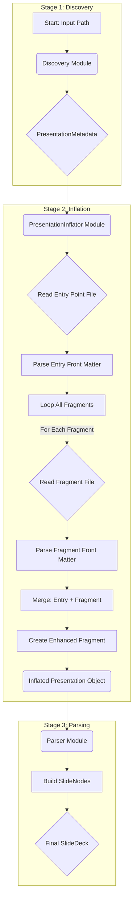

# Feature: F8 - Front Matter Parsing - Technical Design

## 1. Feature Overview

This feature introduces a robust front matter parsing capability into the application through a new, dedicated **Inflation Stage**. This stage sits cleanly between the existing **Discovery** and **Parsing** stages, ensuring a clear separation of concerns.

The core principle is **"Inflate-then-Parse"**. A new `PresentationInflator` module is responsible for all file I/O. It reads fragment content, uses a `FrontMatterParser` utility to extract YAML front matter, and performs a simplified merge operation: the entry point's front matter is used as a base, which is then overridden by each individual fragment's front matter.

The result is a fully inflated `Presentation` object where each `Fragment` contains its final, pre-merged front matter. This object is then passed to the `Parser`, which can now operate without any knowledge of file systems or merge logic, simplifying its implementation significantly.

## 2. System / User Flow

The new architecture follows a clean, three-stage pipeline:



## 3. Change Summary Table

| Module/File Path | Item Name | Status | Description |
|:--|:--|:--|:--|
| `src/core/presentation-inflator.ts` | `PresentationInflator` | New | Handles file reading, front matter extraction, and merging logic. |
| `src/core/front-matter-parser.ts` | `FrontMatterParser` | New | A stateless utility for parsing YAML front matter and merging objects. |
| `src/core/discovery.ts` | `Discovery Module` | Refactored | Responsibility narrowed to only finding file paths and returning `PresentationMetadata`. |
| `src/core/parser/index.ts` | `Parser Module` | Modified | Modified to process `Fragment` objects that now contain pre-processed `frontMatter`. It passes this data to the `SlideNodeBuilder`. |
| `src/core/parser/slide-node-builder.ts`| `SlideNodeBuilder` | Modified | Modified to accept `frontMatter` data and apply it to the `SlideNode` being built, mapping fields to the node's properties. |
| `src/types/presentation.ts` | `Fragment` | Updated | Enhanced to include an optional `frontMatter` object. |
| `package.json` | `gray-matter` | New Dependency | The library used for parsing YAML front matter. |


## 4. Implementation Details

### 4.1. New Module: `FrontMatterParser` (`src/core/front-matter-parser.ts`)

A stateless utility for handling YAML front matter.

#### **Public API**
```typescript
/**
 * Parses raw file content to separate YAML front matter from the main content.
 * @param rawContent The raw string content of a file.
 * @returns An object containing the parsed front matter and the content without front matter.
 */
function parse(rawContent: string): { frontMatter: object, content: string }

/**
 * Merges two front matter objects. Properties from the `overrideObject` will overwrite those in the `baseObject`.
 * @param baseObject The base object (e.g., from the entry point).
 * @param overrideObject The overriding object (e.g., from a specific fragment).
 * @returns A new object with the merged properties.
 */
function merge(baseObject: object, overrideObject: object): object
```

### 4.2. New Module: `PresentationInflator` (`src/core/presentation-inflator.ts`)

Orchestrates the inflation process.

#### **Public API**
```typescript
/**
 * Takes presentation metadata, reads all associated files, processes front matter,
 * and returns a fully inflated Presentation object.
 * @param metadata The PresentationMetadata from the Discovery stage.
 * @returns A Promise resolving to a complete Presentation object.
 */
async function inflate(metadata: PresentationMetadata): Promise<Presentation>
```

#### **Workflow**
1.  Identifies the entry point fragment from `metadata.entryPoint`.
2.  Reads the entry point file and uses `FrontMatterParser.parse()` to get the `baseFrontMatter`.
3.  Iterates through all fragments defined in `metadata.fragments`.
4.  For each fragment:
    *   Reads the file content.
    *   Parses its front matter (`fragmentFrontMatter`) and gets clean content.
    *   Merges the two: `finalFrontMatter = FrontMatterParser.merge(baseFrontMatter, fragmentFrontMatter)`.
    *   Creates an enhanced `Fragment` object with the clean content and `finalFrontMatter`.
5.  Returns a `Presentation` object containing the list of these enhanced `Fragment` objects.

### 4.3. Type Changes (`src/types/presentation.ts`)

The `Fragment` type will be updated to carry the processed front matter.

```typescript
// Updated Fragment Type
interface Fragment extends FragmentMetadata {
  content: string; // Content WITHOUT the front matter block
  frontMatter?: Record<string, any>; // The final, merged front matter object
}
```

### 4.4. Parser and SlideNodeBuilder Modifications

The `Parser` and `SlideNodeBuilder` will be modified to handle the new `frontMatter` property available on each `Fragment`.

-   **Parser Input**: The `Parser` will receive the fully inflated `Presentation` object from the `PresentationInflator`.

-   **Parser Logic**: The core responsibility of the `Parser` is to orchestrate the creation of `SlideNode`s. As it processes each `Fragment` (the entry point first, then any embedded fragments), it will:
    1.  Hold a reference to the `Fragment`'s `frontMatter`.
    2.  Call `splitIntoRawSlides` on the `Fragment`'s `content`.
    3.  For each `RawSlide` returned, it will call the `SlideNodeBuilder`, passing **both** the `RawSlide` and the `frontMatter` from the Fragment the `RawSlide` originated from.

-   **`SlideNodeBuilder` Modifications**: The builder is responsible for constructing the final `SlideNode`. Its `buildSlideNode` method will be updated to accept the `frontMatter` object and apply its values.

    ```typescript
    // Conceptual update to SlideNodeBuilder's build method
    private buildSlideNode(rawSlide: RawSlide, frontMatter?: Record<string, any>): SlideNode {
      const slideNode: SlideNode = {
        id: this.generateSlideId(rawSlide.childLevel),
        content: rawSlide.content,
        fragmentPath: rawSlide.path,
        
        // Apply properties from frontMatter
        title: frontMatter?.title,
        description: frontMatter?.description,
        author: frontMatter?.author,
        date: frontMatter?.date,
        appearance: frontMatter?.appearance,
        userDefinedFrontMatter: frontMatter?.userDefined,
        
        // Existing navigation logic
        navigation: { /* ... */ },
        url: '',
      };

      this.slideNodes.push(slideNode);
      return slideNode;
    }
    ```
    This ensures that the pre-merged `frontMatter` from the inflation stage is correctly applied to every slide derived from a given fragment, with no merge logic needed within the builder itself.

## 5. Test Scenarios (Gherkin)

### 5.1. `FrontMatterParser` Tests

```gherkin
Feature: Front Matter Parser Utility

  @status_complete
  Scenario: Correctly parse content with front matter
    Given a string with a valid YAML front matter block
    When `parse` is called
    Then it should return an object with the parsed 'frontMatter'
    And the 'content' property should not contain the front matter block

  @status_complete
  Scenario: Handle content without front matter
    Given a string without a YAML front matter block
    When `parse` is called
    Then the 'frontMatter' object should be empty
    And the 'content' should be the original string

  @status_complete
  Scenario: Merge two front matter objects
    Given a 'base' object and an 'override' object
    When `merge` is called
    Then the returned object should contain all keys from both
    And properties from the 'override' object should win in case of conflict
```

### 5.2. `PresentationInflator` Tests

```gherkin
Feature: Presentation Inflation

  @status_complete
  Scenario: Inflate a presentation with an entry point and one fragment
    Given a PresentationMetadata with an entry point and one fragment
    And the entry point has 'base' front matter
    And the fragment has its own 'override' front matter
    When the `PresentationInflator.inflate` is called
    Then it should return a Presentation object
    And the fragment in the presentation should have a 'frontMatter' property
    And that property should be the result of merging 'base' and 'override' front matter

  @status_complete
  Scenario: Handle fragments with no front matter
    Given a PresentationMetadata where a fragment has no front matter
    When `inflate` is called
    Then the fragment's final 'frontMatter' should be identical to the entry point's front matter

  @status_complete
  Scenario: Fail gracefully if a file cannot be read
    Given a PresentationMetadata pointing to a non-existent or unreadable file
    When `inflate` is called
    Then the operation should fail with a clear error code (e.g., FILE_NOT_FOUND, PERMISSION_ERROR)
```

## 6. Downstream Parser/Builder Scenarios

The following scenarios are out of scope for the **Inflation Stage** but must be implemented and tested in the **Parser** and **SlideNodeBuilder** modules.

```gherkin
Feature: Parser and SlideNodeBuilder with Front Matter

  Scenario: Create a SlideNode with front matter
    Given an inflated Presentation where a Fragment has a `frontMatter` object
    When the `parser` processes this fragment
    Then the resulting SlideNode's properties (title, author, theme, etc.) should be correctly populated from the `frontMatter` object
    And any fields not part of the standard SlideNode model should be stored in `userDefinedFrontMatter`

  Scenario: Handle a SlideNode with no front matter
    Given an inflated Presentation where a Fragment has an empty `frontMatter` object
    When the `parser` processes this fragment
    Then the resulting SlideNode should be created with default/empty values for its properties

  Scenario: Handle YAML parsing errors gracefully
    Given a slide with invalid YAML that slipped past the inflator (e.g., malformed but not empty)
    When the `parser` processes the slide
    Then the `parser` should log an error or warning
    And the SlideNode should be created with the original content but without front matter
    And the overall parsing process should continue for other slides
``` 