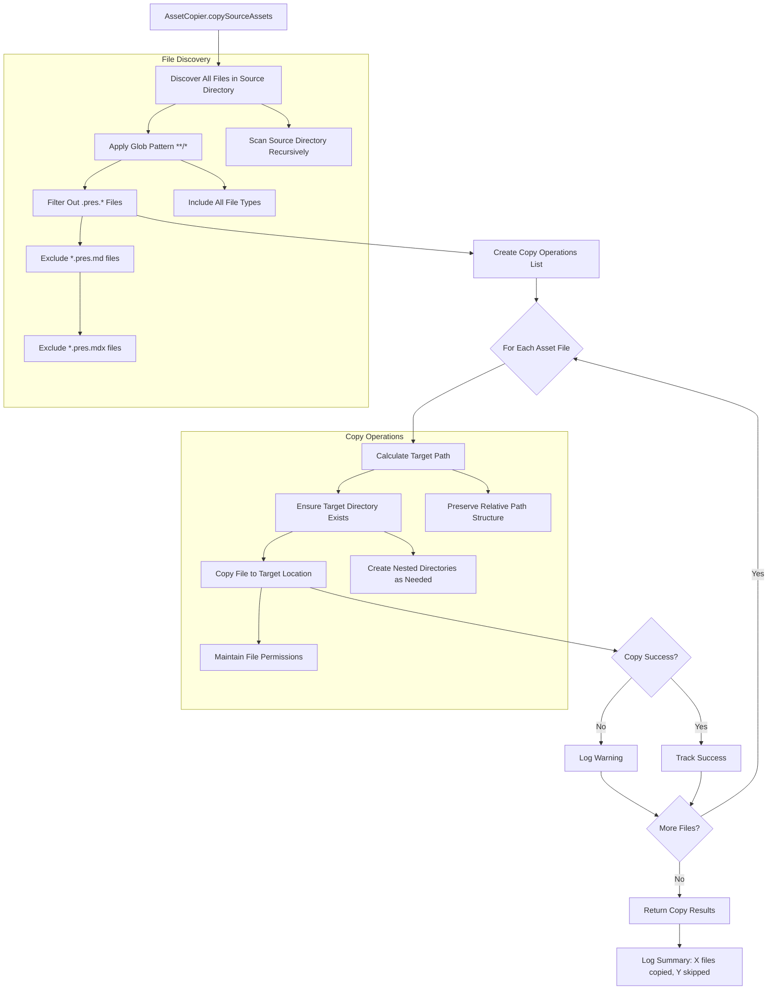

# Feature: Asset Copier - Source Assets - Technical Design

**Purpose**: This document provides the detailed technical specifications for the Asset Copier - Source Assets feature. It includes a technical overview, implementation details for all affected modules and types, and comprehensive test scenarios.

## 1. Feature Overview

The Asset Copier - Source Assets feature implements a straightforward directory tree replication system that copies all non-presentation files from the source directory to the output directory while preserving the complete directory structure. This feature introduces an `AssetCopier` module that performs glob-based file discovery to identify all files excluding `.pres.*` presentation files, then executes parallel copy operations to transfer assets to the output location with identical relative paths.

The asset copier integrates into the existing build pipeline as the final step after content generation, leveraging established `FSUtils` for file operations and `Logger` for progress reporting. Since all asset references in presentations use relative paths, no content modification is required - the preserved directory structure ensures all relative links continue to function correctly in the generated output. The module operates independently of slide content analysis, focusing purely on filesystem operations for maximum simplicity and reliability.

## 2. System / User Flow



## 3. Change Summary Table

| Module/File Path              | Item Name          | Status    | Description                                                                                  |
| :---------------------------- | :----------------- | :-------- | :------------------------------------------------------------------------------------------- |
| `src/types/asset-copier.ts`   | `CopyOperation`    | `New`     | Type representing a single file copy operation, including source and target.                 |
| `src/types/asset-copier.ts`   | `CopyResult`       | `Updated` | Type representing the aggregated result, including total counts and counts by file extension. |
| `src/core/asset-copier.ts`    | `copySourceAssets` | `New`     | Copies all non-presentation files from a source to an output directory.                      |

## 4. Implementation Details

#### 4.1. New/Updated Types (`src/types/asset-copier.ts`)

1.  **`CopyOperation` Type:**
    - **Purpose**: To represent a single file copy operation, containing the source and destination paths.
    - **Structure**:
      ```typescript
      export type CopyOperation = {
        source: string;
        target: string;
      };
      ```

2.  **`CopyResult` Type:**
    - **Purpose**: To provide a summary of the copy process, including a total count, a count of skipped files, and a breakdown of copied files by extension.
    - **Structure**:
      ```typescript
      export type CopyResult = {
        total: number;
        skipped: number;
        byExtension: Record<string, number>;
      };
      ```

#### 4.2. `AssetCopier` Module (`src/core/asset-copier.ts`)

- **Status**: New
- **New/Updated Function**:
  - **`copySourceAssets(sourceDir: string, outputDir: string): Promise<CopyResult>`**
    - **Purpose**: Discovers all non-presentation files in the `sourceDir`, copies them to the `outputDir` while preserving the directory structure, and returns a summary of the operation including counts by file extension.
    - **Implementation Approach**:
      - Initialize a `CopyResult` object with `total: 0`, `skipped: 0`, and `byExtension: {}`.
      - Validate that `sourceDir` exists; if not, throw an error.
      - Use a glob pattern (`**/*`) to find all files recursively within `sourceDir`.
      - Filter out presentation files (e.g., `*.pres.md`, `*.pres.mdx`).
      - For each remaining file, create a `CopyOperation` object.
      - Process all `CopyOperation` objects in parallel.
      - For each successful copy, increment the `total` count.
      - Extract the file extension from the source path.
      - Increment the count for that extension in the `byExtension` map.
      - If a file copy fails, log a warning and increment the `skipped` count.
      - Log a final summary of the operation.
    - **Error Handling**:
      - Throws an error if the source directory does not exist.
      - Catches and logs errors for individual file copy operations, allowing the process to continue. The result will reflect the number of skipped files.

## 5. Test Scenarios (Gherkin)

```gherkin
Feature: Asset Copier - Source Assets

  #---------------------------------------------------------------------------
  # Module: AssetCopier
  # Function: copySourceAssets
  #---------------------------------------------------------------------------

  @happyPath @status_pending
  Scenario: Successfully copy a nested directory structure with mixed assets
    Given a source directory with the following structure:
      """
      /source
        ├── images/
        │   ├── hero.jpg
        │   └── diagram.png
        ├── docs/
        │   └── manual.pdf
        ├── index.pres.md
        └── section1.pres.md
      """
    When copySourceAssets is called
    Then the output directory should contain the copied assets with preserved structure
    And the presentation files ".pres.md" should be excluded
    And the result should report 3 total copied files and 0 skipped files
    And the result should report counts by extension: jpg: 1, png: 1, pdf: 1

  @happyPath @status_pending
  Scenario: Handle an empty source directory
    Given an empty source directory
    When copySourceAssets is called
    Then the result should be successful
    And the result should report 0 total copied files and 0 skipped files

  @happyPath @status_pending
  Scenario: Handle a source directory with only presentation files
    Given a source directory containing only "index.pres.md" and "details.pres.mdx"
    When copySourceAssets is called
    Then the result should be successful
    And the output directory should be empty
    And the result should report 0 total copied files

  @errorPath @status_pending
  Scenario: Fail gracefully if the source directory does not exist
    Given the source directory does not exist
    When copySourceAssets is called
    Then the result should be an error
    And the error message should indicate the source directory was not found

  @errorPath @status_pending
  Scenario: Continue processing even if a single file fails to copy
    Given a source directory with "file1.txt", "unreadable.txt", and "file2.txt"
    And "unreadable.txt" has permissions that prevent it from being read
    When copySourceAssets is called
    Then "file1.txt" and "file2.txt" should be copied successfully
    And the result should report 2 total copied files and 1 skipped file
    And the result should report counts by extension: txt: 2
    And a warning for "unreadable.txt" should be logged
``` 